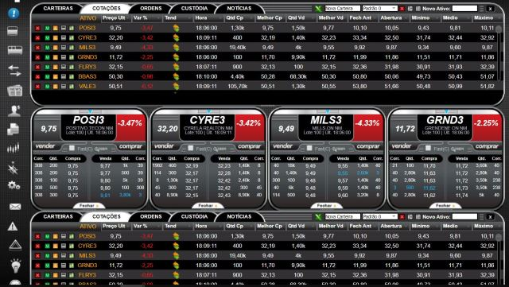
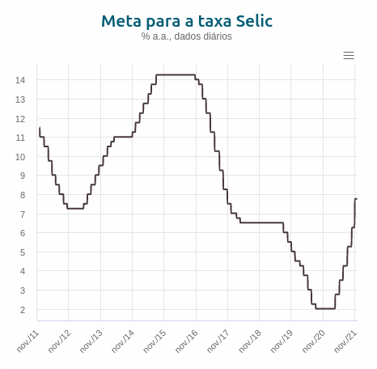
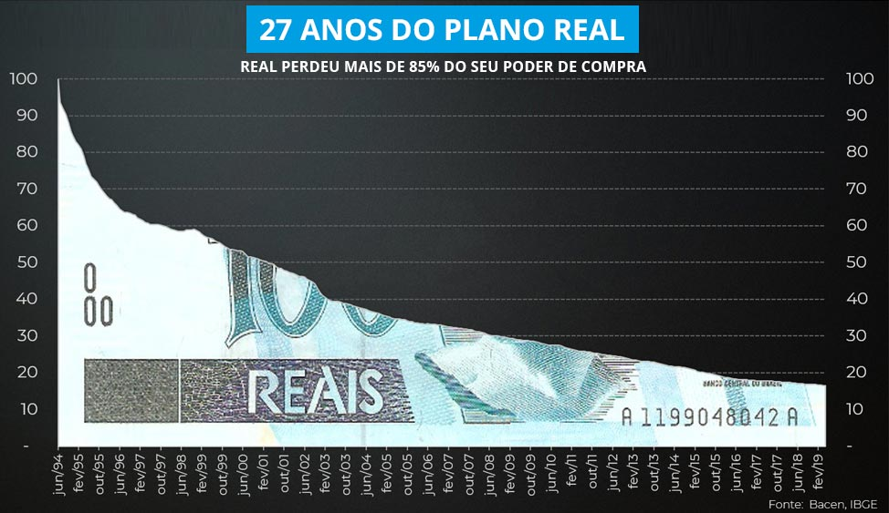
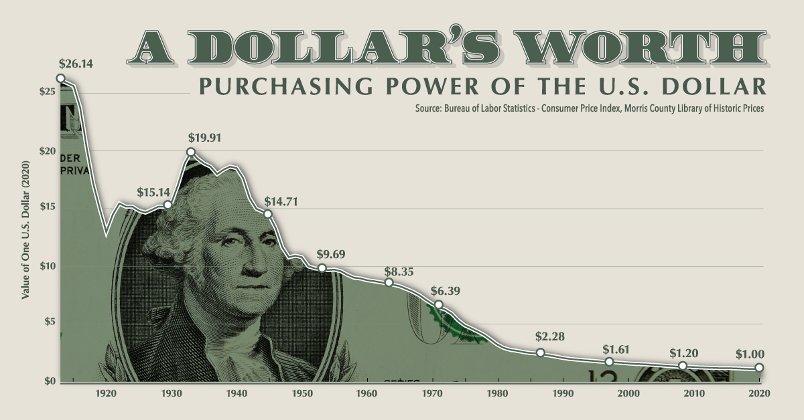

Estamos vivendo uma época de inovações tecnológicas e, ao mesmo tempo, uma época de crises que fazem a população sentir o impacto de algumas medidas políticas. Sou favorável ao questionamento e pensamento próprio para chegar a conclusões. Não gosto da ideia de “carteirada intelectual” e só seguir uma linha de pensamento porque fulano que foi ministro falou, ou estudou em Harvard, ou é do meu partido favorito, ou fala o que agrada os meus sentimentos.

Neste **post** eu irei dar uma ideia geral do conceito de moeda, suas características desejáveis, comparação com moedas fiduciárias (aquelas emitidas por um ente centralizador como o governo, no nosso caso) e apontar alguns dados sobre a realidade monetária.

Decidi escrever este texto em português porque acredito que, no Brasil, alguns temas relacionados à tecnologia e economia são deixados de lado ou tratados de maneira precipitada, criando polêmicas e polarizações onde a análise deveria ser, primeiramente, analítica e objetiva.

Acredito muito na importância da consistência lógica, isto é, se você entende que 1 + 1 = 2, então deve entender que 2 + 2 = 4, **ceteris paribus**. É uma dedução lógica. O problema é que nem sempre isso acontece. Existem muitos exemplos, mas para esse post vamos focar na questão monetária.

Este texto poderia ser muito mais curto, com poucos parágrafos já seria possível expor minha ideia central. Entretanto, eu acredito que seria inútil tentar explicar qualquer conceito se a base da ideia não for mencionada, que é, em suma, o problema da centralização monetária e manipulação artificial de oferta.

## O que é moeda

Moeda pode ser entendida como um produto que, claro, é utilizado como meio de troca. Faço essa relação entre os dois porque a moeda, assim como qualquer produto na economia, está sujeita às mesmas leis e sofrerá as mesmas consequências se submetida a alguma manipulação artificial. Em ambos existe a relação de oferta e demanda e um preço estabelecido a partir dela. Se um ente qualquer decidir distorcer esse preço de qualquer maneira, tabelá-lo ou subsidiar oferta quando não há demanda, em ambos os casos as consequências são similares.

Nossos antepassados nem sempre trocaram carne por uma nota de 100 reais (haja vista que o preço da carne não está muito longe disso). Nos primórdios da humanidade, o ser humano caçava, plantava, e o excedente era trocado por outras mercadorias de seu interesse. Ou, se não, o bem de troca era um serviço a ser prestado em troca de outro ou de um produto propriamente dito.

Entretanto, transportar animais, vegetais ou qualquer outro bem produzido pode ser complicado. Sendo assim, foi demandado ter um meio de troca mais compacto, portável e uma unidade de medida mais universal. Atenção para o “demandado”, foi uma invenção (se é que podemos chamar de invenção) que emergiu da necessidade natural de se fazer trocas de forma mais simples e rápida.

As primeiras moedas foram cunhadas em ouro e prata. Dessa forma, todo o mercado da época pôde se adequar às novas unidades de troca. Ora, em vez de trocar uma galinha por 50 pés de alface, era possível trocar uma galinha por uma moeda de prata e 100 pés de alface por duas, por exemplo. Além do fato de que as moedas foram adotadas em todo o mercado, assim, era muito mais fácil o vendedor de galinha fazer negócios com um vendedor de alface vegetariano, pois este provavelmente não iria se interessar tanto por galinhas.

## O que é valor

É importante ressaltar que quando falamos em “troca” automaticamente pensamos em “valor”. Nesse ponto os marxistas provavelmente vão discordar de mim, mas o “valor” de algo é subjetivo, não existe valor intrínseco. Aqui também peço licença para o pessoal do mercado financeiro porque eles têm costume de usar essa expressão que eu, particularmente, não sou muito fã. Tentarei explicar o motivo.

O valor de um ativo qualquer no mercado está sujeito a algumas variáveis, eu considero três: escassez no mercado (oferta), demanda e valor subjetivo do ativo.

A escassez no mercado é quanto que um determinado ativo está disponível. A demanda é o quanto que um ativo está sendo requisitado. E o valor subjetivo é o potencial que o ativo tem de agregar ao comprador ou recebedor de algum modo, seja financeira, sentimental ou de qualquer outra maneira.

Se o ouro fosse tão escasso quanto a água, não seria tão valioso quanto é. “Ah, Yuri, então você está dizendo que a água não é valiosa? Quero ver você sobreviver sem água e com uma barra de ouro”. Não, não estou dizendo isso, e vou tentar mostrar que esse raciocínio não faz sentido. Vamos a alguns exemplos.

Imagino que você não tenha uma padaria ou não pretenda abrir uma. Sendo assim, quanto você estaria disposto a pagar por um forno de assar pães? Eu posso responder por mim que seria algo próximo a nada. Não trabalho na área e ter um forno me daria mais dor de cabeça do que prosperidade. Porém, existe um mercado em torno disso. Existe uma oferta de fornos, assim como uma demanda e um valor que um forno agrega para alguém que trabalha nesse segmento. “Ah, Yuri, mas isso é óbvio!”. Concordo, mas lembre-se da consistência de raciocínio que mencionei inicialmente.

Se você já fez uma mudança de residência em que você não tinha eletrodomésticos disponíveis, você deve saber o quão difícil é passar alguns dias sem micro-ondas, geladeira ou fogão. Nessas ocasiões, é natural que algumas pessoas paguem um pouco mais para terem esses produtos mais rapidamente à disposição delas. O valor que esse produto vai agregar para alguém nessa situação é diferente do valor que agregaria para uma pessoa que já tem tudo isso em casa e só está cogitando fazer substituições por modelos mais modernos, mas sem muita pressa.

Imagine que um ente querido lhe presenteou com um colar banhado a ouro. Na sua posse, você provavelmente diria “este colar não tem preço”. Na de um terceiro, talvez vire uma noite de balada e combo. Consegue notar que são duas percepções de valor diferentes para o mesmo ativo? É basicamente por essa razão que o mundo é tão completo e interessante, porque as pessoas são atraídas por diferentes desejos, o que faz com que diferentes mercados possam surgir para suprir demandas específicas.

Água é muito importante, sim, é essencial. Porém é menos escassa do que o ouro. Se eu estiver em um deserto tropical, provavelmente irei demandar mais água do que uma barra de ouro. Nesse cenário, eu trocaria facilmente uma barra de ouro por uma garrafa de água. Porém este é o caso extremo, como no exemplo dos eletrodomésticos, é uma situação atípica em que um bem acaba tendo um valor altíssimo para quem o demanda. Em uma grande cidade, não imagino um cenário em que isso ocorreria, visto que a oferta de água é relativamente alta.

Não vou entrar em detalhes sobre a relação oferta e demanda pois assumo que seja algo bem natural a todos, mas é importante que fique claro que essa relação não é uma imposição governamental, ou dos empresários, ou da nova ordem mundial. Nada disso. A relação se dá naturalmente conforme os ativos são mais ou menos procurados, e mais ou menos produzidos em uma determinada região ou população. O objetivo dessa relação é aumentar a produção quando o bem é mais demandado e reduzir caso contrário. Se um ativo A está sendo muito procurado, seu preço tenderá a subir (e sim, você pode pensar que é para maximizar o lucro de quem produz apesar de haver outros fatores envolvidos em toda a cadeia produtiva). Contudo, quando um preço começa a se elevar, outros produtores, muitas vezes de outros mercados, tendem a entrar no novo segmento lucrativo. Com isso, havendo mais oferta, os preços voltam à tendência de queda.

Preços são importantes justamente por transmitirem a informação de oferta e demanda por meio de um valor numérico. Se preços fossem abolidos, toda informação de demanda e oferta de um mercado seria perdida. Dessa forma, seria impossível saber que região está necessitando mais ou menos algum item para, então, aumentar sua produção.

Na minha opinião, a forma mais ilustrativa e que, infelizmente, muitos brasileiros não têm acesso ou interesse, é a negociação de ativos no mercado financeiro.

 Figure 1. Tela de uma ferramenta de home broker brasileira.

A imagem acima é uma captura de tela da ferramenta de homebroker de uma corretora brasileira. Nela, constam as cotações de ações que estão sendo negociadas na bolsa. A cotação é uma média dos preços de ordens de venda que estão sendo executadas. Esse mecanismo funciona, de modo geral, para ações, cotação de moedas (sejam fiduciárias ou cripto) e de qualquer bem que opera em livre mercado. O interessante da tela é que é possível ver em tempo real todas as ordens de compra e de venda que estão sendo abertas, e como isso influencia no preço do ativo. Se uma ordem de venda (alguém decidiu vender) é aberta para um ativo qualquer a um preço X, e ninguém faz uma solicitação de compra, é sinal de que X é um preço muito alto para o momento. A tendência é que as ordens de venda seguintes sejam abertas com valor menor do que X. E o contrário também é ṕossível, se a X a compra é executada muito rapidamente, é sinal de que estão demandando mais o ativo e o valor subirá até haver um eventual equilíbrio.

Preços de vegetais, carne e outros produtos de consumo funcionam da exata mesma maneira, a diferença é que para o consumidor esse mecanismo acaba não sendo tão transparente, a única coisa que temos acesso é ao preço final na gôndola, o que pode resultar em um sentimento que vou tratar a seguir.

## Preços não têm a ver com seus sentimentos

“Nossa, o preço do tomate está um absurdo, é um roubo!”. Já disse ou ouviu isso, né? É triste e, sim, gostaria que os preços de muitas coisas fossem mais baixos. No entanto, existem alguns fatores que influenciaram o aumento do preço não só do tomate, mas de outros vegetais. O pimentão, por exemplo, possui três tipos populares: verde, amarelo e vermelho. Os dois últimos costumam ser mais caros pois o processo produtivo deles é mais delicado, demandam uma atenção que o pimentão verde comum não requer. Um dos fatores do recente aumento de preço desse fruto foi a queda de produção dele no início deste ano, quando não havia demanda por pimentões e muitos estavam sendo descartados, os [produtores decidiram reduzir a produção em 40%](https://g1.globo.com/economia/agronegocios/globo-rural/noticia/2021/01/31/produtores-de-pimentao-sofrem-com-baixa-nos-precos-e-diminuem-area-plantada-no-df.ghtml). Outro fator importante que pode afetar plantações são geadas, variações climáticas e pestes.

O pimentão foi só um exemplo dentre muitos. Meu ponto nessa seção é que o fato de você ficar triste por um preço ter subido e estar acima do que você gostaria de pagar não quer dizer que você esteja sendo injustiçado ou que estão lhe “roubando”. Afirmar isso é como afirmar que todos os milhares de produtores se associaram para subir o preço dos itens ao mesmo tempo para as pessoas não conseguirem comprá-los. É uma teoria um pouco conspiracionista. E, se realmente você acredita que os preços estão elevados sem uma causa fundamental, talvez seja um bom ramo para você começar a atuar. Assim, seu preço estaria abaixo do praticado e você poderia vender muito sem concorrência, concorda? Só um convite para reflexão.

Conceitos introduzidos, vamos retomar ao assunto inicial.

## Propriedades de uma moeda

Existem algumas propriedades que são desejáveis em uma moeda.

#### Escassez

Uma moeda só será útil como meio de troca se houver uma quantidade limitada dela. O ouro e a prata são metais pouco abundantes, e o custo e tempo para mineração são elevados. A dificuldade para produção da moeda é essencial para que não haja inflação a curto ou médio prazo.

Existem muitos algoritmos para criação de unidades de criptomoedas, algumas são deflacionárias e outras não. O Bitcoin, por exemplo, possui uma quantidade limitada matematicamente a 21 milhões. A Monero, a 18,9 milhões de moedas. Já a Nano é uma moeda deflacionária, pois a totalidade de suas moedas foram emitidas na data de sua criação.

Moedas fiduciárias são emitidas, via de regra, por um banco central, uma entidade controladora da oferta monetária. Iremos ver mais adiante o que isso significa e como essa centralização afeta a economia e o seu poder de compra.

O sal também já foi utilizado como moeda em uma época em que a produção dele não era tão simples. Consegue imaginar o quanto de sal teríamos que utilizar hoje para comprar alguns itens no mercado? Imagine carregar quilos e quilos de sal por aí. Isso nos leva à próxima propriedade.

#### Portabilidade

Uma moeda deve ser, idealmente, um item de fácil transporte e porte. Carregar porcos, galinhas, pedaços de madeira e tecidos para todo lugar não é cômodo nem prático. Mas carregar moedas de ouro ou cédulas, por exemplo, é mais prático. Porém, imagine quantos quilogramas de ouro e prata seriam necessários carregar para comprar uma casa. Ou, caso necessite pagar utilizando papel-moeda, quantas maletas de cédula precisaria.

Criptomoedas, por outro lado, permitem o transporte de milhares ou milhões de moedas em uma mesma carteira, podendo estar em um celular, laptop, carteira física ou até um pedaço de papel.

#### Divisibilidade

Uma moeda ideal deve ser capaz de se dividir em frações, para que seja possível transacionar pequenos e grandes valores sem dificuldade (nesse caso me refiro a valor enquanto preço, e não ao que tratamos anteriormente).

No caso de papel-moeda temos várias cédulas e moedas para uma grande quantidade de valores que conseguem atender às necessidades do nosso dia a dia. Porém, se buscarmos valores específicos, como R$ 0,99 (que é bem comum), não temos mais como obtê-lo, nem mesmo pela combinação de outras cédulas e moedas.

Já o ouro tem sua divisibilidade comprometida, pois seria necessário fundi-lo e pesá-lo para conseguir obter uma unidade intermediária.

No mundo das criptomoedas, alcançar a divisibilidade é simples. Você pode transacionar, por exemplo, frações de bitcoin, como 0,015, ou 15mBTC.

#### Durabilidade

A ação do tempo prejudica muitos itens físicos. Cédulas podem rasgar, metais podem sofrer, mesmo que pouco, a ação de intempéries, um pó pode ser dissipado e facilmente perdido. Seu dinheiro no banco é meramente uma entrada (ou conjunto de entradas) em um banco de dados centralizado que pode ser fraudado, editado ou tomado. Quando pensamos em poupança, a durabilidade é um fator fundamental.

Criptomoedas dependem apenas da rede, que é distribuída (em grande parte dos casos), para existirem. Mesmo que você perca sua carteira original, é possível recuperá-la em outro dispositivo. Mesmo que alguém tente fraudar seu saldo na blockchain, será inútil porque todos os outros operadores da rede não irão confirmar a alteração. As únicas formas de você perder suas criptomoedas é perdendo sua chave privada, ou se a rede cair por um evento cósmico ou algo do tipo, mas nesse cenário perderíamos também nossas contas bancárias, dados de identidade, etc.

#### Fungibilidade

Unir elementos de moeda é uma característica desejável de uma moeda. Barras de ouro, por exemplo, podem ser derretidas e então fundidas formando uma nova barra. Entretanto, essa tarefa não é tão simples e não faz parte do nosso dia a dia. Papel-moeda pode ser combinado com outras unidades disponíveis.

As criptomoedas são 100% fungíveis. Se você tem 3 bitcoins e recebe 0,003 bitcoin, sua carteira agora terá 3,003 bitcoins.

Comparando as propriedades mencionadas entre papel-moeda, metais preciosos e Bitcoin (para termos um exemplo mais concreto, estou utilizando o Bitcoin), temos o seguinte:

|  Propriedade   |       Papel-moeda        |         Metais         |         Bitcoin          |
| :------------: | :----------------------: | :--------------------: | :----------------------: |
|    Escassez    | Controlada politicamente | Limitada pela natureza | Limitada matematicamente |
| Portabilidade  |           Alta           |         Média          |         Perfeita         |
| Divisibilidade |           Alta           |         Média          |         Perfeita         |
|  Durabilidade  |          Baixa           |          Alta          |         Perfeita         |
| Fungibilidade  |           Alta           |         Média          |         Perfeita         |

 
Criptomoedas possuem todas as características desejáveis de uma moeda, no entanto existem algumas barreiras que ainda precisam ser superadas. Falarei sobre o que eu acredito mais adiante.

## O problema das moedas fiduciárias

As moedas como o real, dólar, euro, libra e muitas outras emitidas de forma centralizada por governos sofrem, de modo geral, dos mesmos problemas. É fato que algumas acabam se saindo um pouco melhor do que outras por diferentes razões, podendo ser confiança de mercado (valor subjetivo), emissão de moeda feita de modo um pouco mais criterioso, controle de inflação, estabilidade política, etc. Porém, essas moedas possuem curso forçado, ou seja, os cidadãos são obrigados a utilizar essas moedas por força de lei. Se você tiver um estabelecimento comercial e se negar a utilizar o real, por exemplo, você será punido, pois é ilegal.

Mais uma reflexão: se as moedas fiduciárias são boas, porque as pessoas precisam ser coercitivamente obrigadas a transacionar utilizando-as? Afinal, produtos bons são precisam ter o uso forçado, o uso ocorre naturalmente.

Um dos principais problemas das moedas fiduciárias é a capacidade do estado de emitir moeda quando entendem que é necessário.

Provavelmente, em algum momento da sua vida, você já se questionou: “se o estado pode imprimir moeda, por que não imprimem e dão para os pobres e, assim, acabamos com a pobreza?”. Não sei hoje, para a população adulta, o quanto isso é claro, mas esse movimento de expansão da base monetária gera a inflação. A inflação não é o aumento de preços no mercado, mas sim o aumento da quantidade de dinheiro circulante. Ora, se a oferta de bens é a mesma mas a oferta de moeda aumentou, vai ser necessário mais moeda para comprar a mesma quantidade de bens. O aumento de preços é consequência da inflação. Mas se o efeito é negativo, por que o governo faria isso? De modo geral, para pagar dívidas.

Ao imprimir moeda, existe uma sequência de vítimas dessa ação. As primeiras que recebem esse dinheiro recém impresso sofrem menos do que as últimas. Na verdade, as primeiras não sofrem, mas sim usufruem do novo dinheiro. A explicação se dá pelo efeito [Cantillon](https://www.doctrader.net/blog/CantillonFed2020). Em resumo, quando os últimos (consumidores e população em geral) recebem esse dinheiro, a informação da emissão já foi propagada e o mercado já se deu conta de que existe mais oferta de dinheiro. Nesse momento, os preços já subiram e o consumidor precisará despender uma quantidade maior de dinheiro. Em contrapartida, os primeiros recebedores do “dinheiro fresco” poderão gastá-lo como bem entenderem porque a emissão ainda não foi notada pelo mercado.

Imagine que você tem a capacidade de fraudar o real com perfeição. Imprime 5 trilhões de reais mas guarda tudo dentro de um cofre. A economia não se dará conta dessa impressão. Imagine que você gaste 100 mil reais desse montante. Para o mercado não haverá uma mudança significativa. Agora despeje os 5 trilhões comprando carros, casas e empresas. Agora sim a informação começará a se propagar. Os primeiros recebedores poderão gastar sem tanto efeito, mas conforme o tempo passa, os preços começam a subir devido ao aumento da quantidade de dinheiro em circulação.

Existem muitas formas de emissão de moeda, não necessariamente via impressora da casa da moeda. A expansão da base monetária pode ser feita via manipulação da taxa de juros, subsídios via bancos estatais, reserva fracionária ou impressão propriamente dita.

### Taxa de juros

A taxa de juros expressa o preço do dinheiro. Se a taxa de juros está alta, é porque ou a demanda por dinheiro está alta (como empréstimos), ou muita gente não está poupando (oferta baixa). Lembra que eu comentei sobre moeda ser um produto pois se comporta exatamente da mesma maneira que um? Pois é, moedas deveriam ter seu preço definido naturalmente na economia. Na verdade elas têm quando olhamos externamente. O real vs dólar tem um preço definido por mercado. Não é o governo brasileiro (geralmente) que diz quanto o dólar custa, é o mercado. Porém, dentro do país, quem define a taxa de juros é o governo.

Vamos ao exemplo atual do Brasil. A inflação brasileira nos últimos 12 meses, segundo o [IBGE pelo IPCA](https://www.ibge.gov.br/explica/inflacao.php), passou de 10%, que é um acúmulo considerado alto.

Ao mesmo tempo, a meta da [taxa Selic](https://www.bcb.gov.br/controleinflacao/taxaselic) (a taxa básica de juros), ficou abaixo dos 3% pela maior parte do tempo. Que é uma taxa relativamente baixa considerando o histórico de juros do Brasil.

 Figure 2. Meta para a taxa de Selic.

A oferta de moeda tem efeito direto nos preços de mercado, e o governo mantém também uma taxa básica de juros. Existem duas variáveis que ficam sob controle governamental que as manipula da forma como bem entende. Existem muitas estratégias do ministério da economia, as quais variam dependendo do espectro político do governo e do que desejam fazer a curto, médio e longo prazo.

Em suma, o governo pode colocar mais dinheiro em circulação e manipular artificialmente o valor da taxa de juros para incentivar o consumo, investimentos em títulos públicos e privados.

### Subsídios via bancos estatais

O BNDES é um banco nacional para fomento. A ideia original dele é estimular setores estratégicos da economia oferecendo empréstimos a juros reduzidos e subsidiados. Parece uma boa ideia com um nobre objetivo. Porém a realidade não é bem essa.

O BNDES é um banco que estimula os setores que o governo acha estratégicos. [Muitas empresas de grande porte](https://www.bndes.gov.br/wps/portal/site/home/transparencia/consulta-operacoes-bndes/maiores-clientes), multinacionais, receberam e continuam recebendo verbas do BNDES e, muitas delas, ainda são devedoras.

Para todos a taxa de juros é a corrente, mesmo que “canetada” pelo governo. No entanto, alguns recebem o privilégio de juros mais baixos do que os praticados pelo mercado. Quem paga essa conta? Nós. Não existe mágica, a diferença dos valores da taxa de juros é subsidiada pelo governo e é coberta via emissão de títulos do tesouro nacional e FAT (PIS-PASEP), que são impostos.

### Reserva fracionária

As reservas fracionárias permitem que os bancos efetuem empréstimos ou investimentos de valores que não possuem. Sendo bem pragmático, é o direito que o estado confere às instituições financeiras de criarem dinheiro “do nada”.

O modelo bancário atual é baseado na ideia de que a maior parte das pessoas não vão sacar seus depósitos, ou pelo menos não ao mesmo tempo. Dessa forma, os bancos podem conceder empréstimos de valores que eles não possuem. O sistema de reserva fracionária, garantido por lei, permite aos bancos terem apenas uma fração do montante que podem ofertar ou investir.

Por exemplo, imagine que um banco soma a quantia de 100 milhões sob sua custódia. Se a taxa de reserva fracionária (definida pelo banco central do país) estiver em 10%, o banco só precisa manter 10 milhões em seus cofres, os outros 90 milhões podem ser oferecidos para fins de empréstimo, por exemplo.

Se os clientes desse banco decidirem sacar os 100 milhões de reais de suas contas, não conseguirão, pois o banco não tem todo esse valor à disposição. A consequência disso seria que os clientes não conseguiriam reaver seu dinheiro quando precisassem. Esse efeito [ocorreu na Grécia](http://g1.globo.com/jornal-nacional/noticia/2015/06/grecia-fecha-bancos-e-limita-saques-antes-de-referendo-sobre-economia.html) há pouco mais de 10 anos, quando os bancos limitaram o saque dos clientes a 60 euros por dia. Em muitos casos, o governo vai ao salvamento de instituições privadas que ficam insolventes, onde mais uma vez a população que arca com as manobras (legais) do sistema financeiro e do banco central.

## Visão geral da inflação

No Brasil, o real já perdeu 85% do poder de compra desde o plano real. O que em 1994 você comprava com R$ 100,00, hoje você precisaria de R$ 627,00.

 Figure 3. Desvalorização do Real desde 1994.

Já nos Estados Unidos, um dólar hoje equivale a 26,14 dólares em 1913.

 Figure 3. Desvalorização do Dólar desde 1913.

## O desafio para a adoção de criptomoedas

Toda invenção possui um tempo de adoção, por melhor que ela seja. Existe um processo de entendimento do mecanismo básico, superação de desconfianças e liberdade de escolha. Não acredito que pelo fato de envolver uma matemática complexa as criptomoedas são ignoradas, ou seja, por estarem aquém da capacidade de entendimento popular. E creio nisso simplesmente porque a população em geral não sabe como um banco funciona em detalhes - e eu me incluo nesse grupo. Porém, ainda assim, utilizam seus serviços, seja para transações do dia a dia, investimentos, saques, empréstimos ou qualquer outro serviço que a instituição financeira seja capaz de oferecer.

Hoje existem milhares de criptomoedas, algumas com objetivos claros, descentralizadas, deflacionárias, instantâneas, sem taxa, e outras na direção oposta. Há moedas para quase todos os gostos. O fato é que o Bitcoin, por ter sido o precursor, contar com uma comunidade muito grande e possuir algumas características bem particulares, acaba sendo a moeda mais famosa e usada de referência em muitas situações. Entretanto, o Bitcoin em si não é tão adequado para transações cotidianas pelo fato de (1) o tempo de confirmação de uma transação ser elevado. Existem esforços para mitigar esse problema, como a [Lightning Network](https://lightning.network/), porém ainda existe um longo caminho a se percorrer; e (2) a taxa por transação não é viável para pequenas quantias transacionadas.

Evidentemente existem moedas adequadas a diferentes situações. Se você quer uma moeda com mercado e comunidade gigantes, Bitcoin é uma ótima solução. Se deseja privacidade, Monero pode ser uma boa opção. Se busca velocidade e ausência de taxas, Nano pode ser uma escolha interessante.

Enfrentar o preconceito e o senso comum também são necessários se quisermos vislumbrar um futuro mais digital e livre. Para isso, é necessário esclarecer alguns pontos que são disseminados por aí de maneira equivocada, ou que muitos políticos e burocratas gostam de propagar.

## Uma moeda global

É claro que para uma moeda possuir este título ela deve ser aceita e considerada como tal. A ideia de se ter uma moeda global não é nova, e tem um lado positivo mas também um negativo.

O lado positivo é que qualquer operação financeira poderia ser realizada independentemente de fronteiras, não seria necessário fazer câmbio, contas seriam facilitadas e todos usariam a mesma unidade de medida.

O lado negativo é que limitaria o surgimento e adoção de moedas melhores. Ao meu ver, existem moedas melhores do que o Bitcoin, por exemplo, por serem ecologicamente mais amigáveis, mais baratas e mais rápidas. Porém essas moedas surgiram anos depois do Bitcoin. Em um mercado, especialmente o de tecnologia, a inovação é constante, então limitar a moeda a uma única pode conter o desenvolvimento natural do segmento.

Acho pouco provável uma só moeda ser usada globalmente sem uma instituição coercitiva. Isto é, acredito que se alguém definir o dólar, bitcoin ou qualquer outra moeda como “a moeda do mundo”, seria por força de lei, alguma instituição faria imposição. E sou totalmente contra medidas dessa natureza.

Ao meu ver, caso alguma moeda se torne global é por excelência, não imposição. E, sendo por excelência, seus utilizadores estariam abertos a migrar caso alguma nova solução fosse apresentada.

## Comentários frequentes sobre criptomoedas

### São bolhas

Depende da definição de “bolha” que é usada. No meu entendimento, uma bolha é a valorização de um ativo sem causa fundamental. Uma corrida frenética por um ativo sem razão alguma, podendo ser um movimento de manada ou incentivado por algum incentivo distorcido.

Um exemplo de movimento de manada são criptomoedas criadas recentemente proveniente de memes, que não possuem um conceito e só são emitidas para os criadores darem saída quando o hype chega e lucrarem com isso. Por isso é importante estudar bastante e entender onde você coloca seu dinheiro!

Um exemplo de incentivos distorcidos foi a [bolha dos caminhões](https://braziljournal.com/a-bolha-dos-caminhoes-uma-crise-gerada-em-brasilia) criada pelo então governo da presidente Dilma Rousseff em 2014, em que utilizou o BNDES para subsidiar caminhões quando não havia demanda por eles, jogando o preço do frete lá pra baixo e gerando uma crise no setor.

Bitcoin, Ethereum, EOS, são todas redes e moedas que possuem fundamentos e objetivos. Tecnologias que se propõe a resolver problemas do mundo real e melhorar o mundo, cada uma de uma forma. Não significa necessariamente que são boas ou que de fato vão resolver, mas existe um conceito que muitas empresas estão aplicando como modelo de negócios, como oferecimento de microcrédito, saúde descentralizada, jogos, contratos, documentos, etc.

### São para cometer crimes

Bitcoin é rastreável e já foi possível vincular moedas a crimes. É um mito dizer que não é possível fazer rastreio. Claro, não é tão intuitivo e exige um certo trabalho, mas não é impossível.

Eu acredito que hoje a maior parte dos crimes que ocorrem utilizam moedas fiduciárias. Golpes, fraudes, corrupção, furtos e roubos, todos tendem a utilizar cédulas que são irrastreáveis por natureza, pois não existe um livro registrando as transações feitas com uma cédula de dinheiro, quem recebeu, de onde veio, qual o montante e quando ocorreu.

### Não tem lastro

Lastro é a garantia de um determinado ativo. Pode ser uma surpresa para muitos, mas hoje nenhuma moeda fiduciária possui [lastro em ouro](https://pt.wikipedia.org/wiki/Padr%C3%A3o-ouro) ou em algum ativo. Os lastros atuais das moedas governamentais são baseados em emissões de títulos de dívida pública, ou seja, em confiança.

Então se engana quem pensa que real, dólar ou euro são emitidos seguindo uma reserva de ouro nacional. Apenas confiamos que o governo não emitirá tanta moeda de forma inconsequente.

Muitas criptomoedas utilizam a matemática como lastro. Pode ser uma taxa de emissão baseada na velocidade aproximada de mineração de ouro; pode ser uma taxa fixa de emissão eterna ou limitada a uma data; ou até mesmo pode ter uma quantidade de moedas não variável desde o início.

### São para especulação

Não só criptomoedas podem ser usadas para especulação, mas qualquer ativo na economia pode. Algumas pessoas especulam com dólar, euro, real, rublo, yen, ações, cotas de fundos, opções, imóveis, carros, enfim… Qualquer ativo é passível de especulação. Se a crítica for feita, deverá ser feita de forma abrangente, de modo que o argumento especulativo acaba caindo por terra.

## Criptomoedas que salvaram vidas

Hoje temos a capacidade de tratar o tema de criptomoedas como uma questão de escolha. Estamos focados em discussões sobre ser ou não um bom investimento, se é ou não especulativo, ou até mesmo como o governo pode taxar esse novo ativo que as pessoas estão utilizando.

Contudo, para algumas famílias que vivem ou viveram em países ditatoriais que inflacionaram sua moeda de modo que a vida se tornou uma questão de sobrevivência, criptomoedas tiveram uma papel fundamental na obtenção de alimentos e recursos básicos.

Deixo alguns textos como recomendação de leitura:

[Venezuelanos investem em bitcoin para encarar desemprego, hiperinflação e falta de notas](https://g1.globo.com/mundo/noticia/venezuelanos-investem-em-bitcoin-para-encarar-desemprego-hiperinflacao-e-falta-de-notas.ghtml)

[O Bitcoin foi o que impediu minha família de morrer de fome na Venezuela](https://ab2l.org.br/o-bitcoin-foi-o-que-impediu-minha-familia-de-morrer-de-fome-na-venezuela/)

[Venezuelano Cria Campanha ”Adote uma Família” e Pede Doações em Criptomoeda](https://portaldobitcoin.uol.com.br/venezuelano-cria-campanha-adote-uma-familia-e-pede-doacoes-em-criptomoeda/)

Também recomendo o documentário [Banking on Africa](https://www.youtube.com/watch?v=_VT_zpHQzBE), que traz a ideia por trás da moeda e mostra como isso tem mudado a realidade de comunidades na África.

## Conclusão

Conforme quis mostrar, como em qualquer outro produto, a relação de oferta e demanda também está, ou deveria estar, presente no que diz respeito a moedas. O sistema monetário vigente monopoliza a emissão e as taxas de juros e não permite que moedas se comportem como ativos em âmbito interno, já que mencionei que externamente o mecanismo de preços ocorre livremente.

Economistas e pensadores mais ortodoxos acreditam que todo esse controle é necessário, que sem isso a economia colapsaria, afinal quase todos os países do mundo adotam esse sistema. Porém, minha pretensão nesse texto não é dizer que o governo faz errado ou que as coisas deveriam ser de outra maneira. Apesar de eu ser um grande entusiasta de tecnologia e criptomoedas, o mais importante é fazer com que as pessoas que estão próximas de mim, sejam amigos, conhecidos ou até desconhecidos, tenham ciência de como funciona o sistema monetário atual, que as taxas são manipuladas; que seu dinheiro que está no banco só está lá digitalmente; que a inflação corrói o poder de compra da população; e que governo subsidia juros via banco de fomento utilizando o dinheiro da população. Cabe a você, caro leitor, decidir e entender se essas medidas são positivas ou não, e se precisam ser feitas da forma como os governos fazem para manter uma economia “em ordem”.

Se você quer ser dono de fato do seu próprio dinheiro e não estar sujeito a decisões e preferências de políticos que afetam a economia e o sistema bancário, talvez criptomoedas possam ser uma opção a se considerar. Para entender de forma bem simples o que é Bitcoin, recomendo um trecho do livro “[Bitcoin: a moeda na era digital](https://rothbardbrasil.com/bitcoin-a-moeda-na-era-digital/)” do economista brasileiro Fernando Ulrich que está disponível [aqui](https://www.infomoney.com.br/colunistas/moeda-na-era-digital/dez-formas-de-explicar-o-que-e-bitcoin/). E, claro, recomendo a leitura na íntegra da obra [aqui](https://rothbardbrasil.com/bitcoin-a-moeda-na-era-digital/).

Espero que eu possa ter agregado um pouco de informação a você que chegou até aqui.

Muito obrigado e até a próxima!
