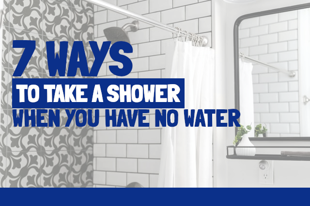
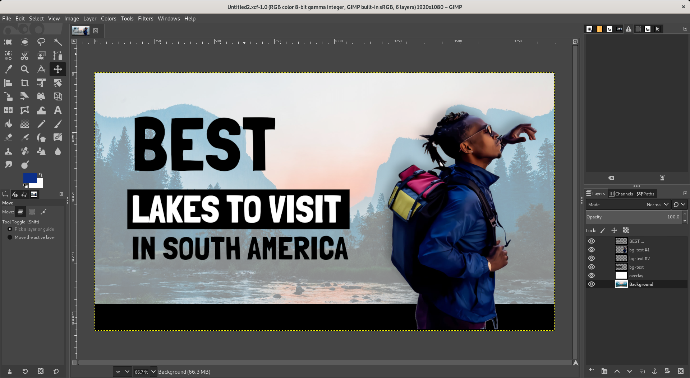
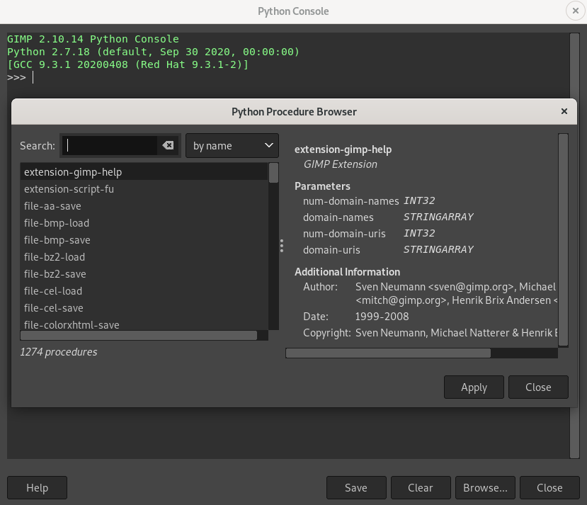
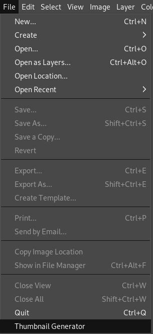
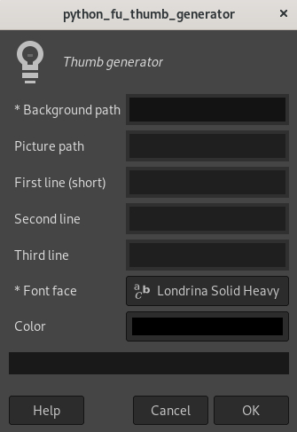
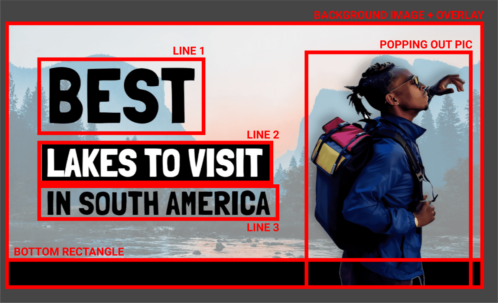

If you already had to edit a photo to remove a pimple from your face, cut someone you don’t like, make your skin smoother or just create some art design, you probably had contact with a very famous software called Photoshop. 

Photoshop is an image/graphics editor developed by (among others) Adobe Inc. firstly released in 1988 and became a reference in its segment due to its myriad of cool features and relatively easiness of operation. In Photoshop you can become a [celebrity in a couple of hours](https://www.boredpanda.com/before-after-photoshop-celebrities/), create website layouts and even some graphic designs.

Anyway, today we aren’t going to talk about Photoshop, but an [open-source](https://en.wikipedia.org/wiki/Open-source_software) and very nice option to it called [GIMP](https://www.gimp.org/). This guy is very powerful and lets you do amazing things, achieving great results as well as the Adobe software. BTW, I know people who prefer using GIMP to Photoshop. 🤷 

I consider GIMP a little more difficult to use but in the latest releases they improved the UI and made things easier and cleaner. And the best part of GIMP is: it’s free and available for Windows, Linux and macOS!

## What we want to solve
Before starting to code, let’s think for a minute about the amount of information published to the web every hour. You probably follow some Youtubers that produce content frequently, maybe once, maybe twice a week, sometimes every day. Their videos usually require nice and attractive thumbnails to catch their audience's attention and bring views to the videos. If you have a huge channel and get a good profit from it, creating thumbnails may not be a problem because you can afford hiring someone to make this work for you. However, if you're a new kid on the block you’ll probably spend some time in this process and, we all know, time is precious. So let’s create something to save content producer’s time and make everything in a blink of an eye.

## Spoiler

Those are some of the results we’re going to achieve today:

 

## What I wanted
It’s important to define what we expect before starting to code. 
I made a search on Google in order to get thumbnail ideas and decide which one would be a good fit. After gathering all interesting options, I came out with this GIMP file:

> **Important**: it was not a copy of any I’ve seen, I created a new one using my search only as reference and inspiration. 

First of all, I have to give credits to the background images I used to write this post. All of them I got from [Unsplash](https://unsplash.com?utm_source=unsplash&utm_medium=referral&utm_content=creditCopyText) published by [Bailey Zindel](https://unsplash.com/@baileyzinde?utm_source=unsplash&utm_medium=referral&utm_content=creditCopyText), [Sharon McCutcheon](https://unsplash.com/@sharonmccutcheon?utm_source=unsplash&utm_medium=referral&utm_content=creditCopyText), [Andrea Davis](https://unsplash.com/@andreaedavis?utm_source=unsplash&utm_medium=referral&utm_content=creditCopyText), [Ania Archer](https://unsplash.com/@ania44?utm_source=unsplash&utm_medium=referral&utm_content=creditCopyText) and [David Rangel](https://unsplash.com/@rangel?utm_source=unsplash&utm_medium=referral&utm_content=creditCopyText). The popping out pictures I took from Google and edited them, so I’m not sure about the authors.

Considering my research, a thumbnail usually have three important elements:
1. A background (may be an image or solid color, in our case will be an image)
2. A brief and catchy text about the content you are sharing (three lines max. in our case)
3. A popping out picture to call audience’s attention (optional for us)

It’s also important to think that we don’t know the size of the background image beforehand, it may be a huge or small one. Therefore, we must display all elements in a proportional and relative size.

Now, thinking about parameters we’ll read:
1. A background path as string
2. A picture path as string
3. The text lines as strings (1, 2 and 3)
4. The font face as string
5. The theme color as string

## Setting up GIMP
If you still don’t have it, download and install [GIMP](https://www.gimp.org/).

We are going to use a feature of GIMP called [Python-Fu](https://docs.gimp.org/en/gimp-filters-python-fu.html) that allows us to write Python code and turn it into a plug-in to manipulate elements in the screen. The main procedures in GIMP are written in a functional [Lisp dialect](https://en.wikipedia.org/wiki/Lisp_(programming_language)) called [Scheme](https://en.wikipedia.org/wiki/Scheme_(programming_language)). GIMP exposes them in an API called [Procedure Database (PDB)](https://www.gimp.org/docs/python/procedural-database.html). This API will be our confederate while we develop the plug-in.

In order to make GIMP recognize a script as a plug-in, we must add the Python file within the GIMP’s plug-in folder. To check or change where GIMP folders are located in your machine, open GIMP and go to `Edit > Preferences > Folders`. In my machine they are located in `~/.config/GIMP/2.10`.

All the plug-ins have some lines dedicated to [register](https://docs.gimp.org/en/gimp-using-script-fu-tutorial-first-script.html) the plug-in. Those lines will name, describe and address the plug-in to the GIMPs UI.

## Python Fu
As I mentioned before, GIMP lets the use of Python to reach PDB. The PDB functions will let us create layers, add them to the image, load files, draw elements, position and reposition them and much more. Basically, everything you can perform in the GIMP’s UI can pretty much be achieved with Python Fu.

To know which function I should call for a certain operation, I constantly consulted the docs [here](https://www.gimp.org/docs/python/procedural-database.html) and [here](http://oldhome.schmorp.de/marc/pdb/index.html). To see the name, parameters description and whether it was deprecated, I also used the Procedure Browser that can be accessed in `Filters > Python Fu > Console > Browse...`. A dialog box will open and searches can be made in the PDB using different fields.

When selecting a function in the left and clicking “Apply”, the command will be added in the Python console that is supposed to be opened behind the current dialog box. Thus, you can copy and paste the command to the Python script.

The complete documentation of scripting with Python in GIMP can be read [here](https://www.gimp.org/docs/python/index.html).

The introduction is done, now let’s start coding.

## Creating the main file
Create a file called `thumbnail_generator.py` (or any other name you want) within the GIMP’s plug-in folder and copy the following piece of code:

<code-highlight language="python">
def thumb_generator(background_path, picture_path, first_line, second_line, third_line, font_face, color=(0.0, 0.0, 0.0)):
    pass
    
register(
    "python_fu_thumb_generator",
    "Thumb generator",
    "Create a thumbnail",
    "Yuri Delgado",
    "Yuri Delgado",
    "2021",
    "Thumbnail Generator",
    "",     
    [
        (PF_STRING, 'background_path', '* Background path', ''),
        (PF_STRING, 'picture_path', 'Picture path', ''),
        (PF_STRING, 'first_line', 'First line (short)', ''),
        (PF_STRING, 'second_line', 'Second line', ''),
        (PF_STRING, 'third_line', 'Third line', ''),
        (PF_FONT, 'font_face', '* Font face', 'Londrina Solid Heavy'),
        (PF_COLOR, "color", "Color", (0.0, 0.0, 0.0))
    ],
    [],
    thumb_generator, menu="<Image>/File")
</code-highlight>

The function register will register (really?) our plug-in and make it visible and accessible from GIMP. You can check the documentation of it [here](https://www.gimp.org/docs/python/index.html).

The params we are using are the ones previously mentioned in "What I wanted" section. We have to make GIMP aware of the type of param, variable name and a default value for the field. I’m using the same variable names in the  `thumb_generator` definition.

In order to test if GIMP is recognizing the plug-in, close and reopen GIMP, go to `File` in the toolbar and your new plug-in should be at the end of the list.

Opening the plug-in, you should see the dialog box with all the inputs we defined.

## Wrapping functions
The PDB functions sometimes are confusing and full of parameters. Some functions don't take into account positional arguments, like `pdb.gimp_file_load(run_mode, filename, raw_filename)`, which can receive `run-mode` or not as argument. Therefore, I’ve chosen to wrap some operations in Python functions to make the use easier and clearer.

I created another file called `utils.py` (in the plug-in root) to gather all useful functions and abstract the logics. You can see the whole file [here](https://github.com/yuricd/gimp-scripting/blob/master/utils.py).

### log

The first function I wrapped was the `log` function:

<code-highlight language="python">
def log(msg):
    pdb.gimp_message(msg)
</code-highlight>

This function will be useful for debugging the execution whenever GIMP fail to open the plug-in box or throw an exception.

When you have a general syntax issue in your code, GIMP won't even open the plug-in box. Sometimes, it will prompt the error in the screen or just log in the Error Console tab (to make it visible, click in the `arrow at the top right of GIMP’s UI > Add tab > Error Console`).

### load_file

Since we have the path of the background image (it should be in your filesystem), we just have to load and display it. This image will be the base of the whole art and you are going to see a reference to it along the code. Understand `image` as the “stage” of the art.

<code-highlight language="python">
def load_file(path):
    img = pdb.gimp_file_load(path, path)
    gimp.Display(img)
    return img
</code-highlight>

In line 2, the image is loaded using `pdb.gimp_file_load` and you can check the details in the Python Procedure Browser as I mentioned previously. After, in line 3, we display the image in a new window.

### add_layer
When you create a layer, you may want to add the layer to an image. You can check the params in the documentation.

<code-highlight language="python">
def add_layer(image, layer, parent=None, position=-1):
    pdb.gimp_image_insert_layer(image, layer, parent, position)
</code-highlight>

### load_image
This function will load an image into a layer (it was different from the `load_file` we did before) and return the layer, with the option of adding the layer to the `image` to save some time. 

<code-highlight language="python">
def load_image(image, path, add_to_img=True):
    layer = pdb.gimp_file_load_layer(image, path)
    if add_to_img:
        add_layer(image, layer)
    return layer
</code-highlight>

### create_layer
To create a single layer, we do the following:

<code-highlight language="python">
def create_layer(image, width, height, image_type, name, opacity, mode, add_to_img=True):
    layer = pdb.gimp_layer_new(image, width, height, image_type, name, opacity, mode)
    if add_to_img:
        add_layer(image, layer)
    return layer
</code-highlight>

Here I used the same “trick” as I did in `load_image` because we usually want to create the layer and add it to the image. You can check the params in the documentation, but most of them are self-explanatory.
 
### translate_layer
That’s it, just translate a layer to `(x, y)` (it starts in top left):

<code-highlight language="python">
def translate_layer(layer, x, y):
    pdb.gimp_item_transform_translate(layer, x, y)
</code-highlight>

### scale_layer
Since we don’t have fixed sizes, it’s important to resize/scale layers if needed.

<code-highlight language="python">
def scale_layer(layer, new_width, new_height=None, keep_proportion=True):
    height = new_height
    if keep_proportion:
        height = int(round(float(layer.height) * (float(new_width) / float(layer.width))))
    return pdb.gimp_layer_scale(layer, new_width, height, False) # false to keep the same coord
</code-highlight>

In order to avoid calculating the new height based on the given width, this function abstracts it and resizes proportionally (and optionally) the image. The `False` param is for anchoring. Thus, it keeps the image in the same “position”.

### add_text
Add a text with the given content, position, font size and face to an image.

<code-highlight language="python">
def add_text(image, x, y, content, font_size, font_face, drawable=None):
    return pdb.gimp_text_fontname(image, drawable, x, y, content, 0, True, font_size, PIXELS, font_face)
</code-highlight>

### set\_layer\_text\_color
Just change the text color of a given layer.

<code-highlight language="python">
def set_layer_text_color(layer, color):
    return pdb.gimp_text_layer_set_color(layer, color)
</code-highlight>

[Here](https://github.com/yuricd/gimp-scripting/blob/master/utils.py) you can see the final version of the `utils.py` file.

## Writing the plug-in
With the utilities file ready, it’s easier to write the plug-in itself.

Now it’s time to treat and assemble each piece of the thumbnail using the functions created in `utils.py`. 

### Set foreground color
Since we have a custom color defined by the user, it's necessary to set the foreground to this value.

<code-highlight language="python">
pdb.gimp_context_set_foreground(color)
</code-highlight>

### Loading the background
The second task is to load the background image and display it in a new window.

<code-highlight language="python">
img = my.load_file(background_path)
gimp.displays_flush()
gimp.context_push()
</code-highlight>

In line 2 I [flushed](http://oldhome.schmorp.de/marc/pdb/gimp_displays_flush.html) the screen in order to update the UI to reflect all pending operations I’ve done. In line 3, I call `gimp.context_push` to restore the context at the end of code if it’s necessary. The code should work properly even without this line. 

### Adding overlay
The overlay is just a layer with a white background and opacity that covers the whole background image.

<code-highlight language="python">
overlay = my.create_layer(image=img, width=img.width, height=img.height, image_type=RGB_IMAGE, 
                           name='overlay', opacity=35, mode=NORMAL_MODE, add_to_img=False)
overlay.fill(FILL_WHITE)
my.add_layer(img, overlay)
</code-highlight> 

### Adding bottom rectangle
Here I considered the height of the bottom rectangle as 9% of the background size, created the layer, filled with the defined foreground color and translated it to the right side of the stage.

<code-highlight language="python">
bottom_rect_h = int(round(img.height * .09))
bottom_rect_layer = my.create_layer(image=img, width=img.width, height=bottom_rect_h, image_type=RGB_IMAGE, 
                                    name='bottom_rect', opacity=100, mode=NORMAL_MODE)
pdb.gimp_drawable_edit_fill(bottom_rect_layer,FILL_FOREGROUND)
my.translate_layer(bottom_rect_layer, 0, img.height - bottom_rect_h)
</code-highlight> 

### Loading popping out image
<code-highlight language="python">
if (picture_path):
    picture_layer = my.load_image(img, picture_path)
    picture_w = int(round(img.width) * .47)
    my.scale_layer(picture_layer, picture_w, keep_proportion=True)
    my.translate_layer(picture_layer, img.width - picture_w, img.height - picture_layer.height)
    pdb.script_fu_drop_shadow(img, picture_layer, -4, -4, 20, '#000000', 90, FALSE)
</code-highlight>

The popping out image is optional.

I performed some operations in the following sequence:
1. Load the image
2. Calculate and resize the picture to have 47% of the background width keeping the proportions.
3. Translate the image layer to the right side of the stage.
4. Drop a smooth shadow behind the image. 

### Adding text
I used `Londrina Solid Heavy` as the font face in my example, but you can use any other. However, be aware that it may break the whole design because of the width difference among font faces.

<code-highlight language="python">
font_size_big = img.height * .24
font_size_ordinary = img.height * .12
margin_top = img.height / 7
margin_left = img.width / 25
    
first_line_layer = my.add_text(image=img, x=margin_left, y=margin_top, content=first_line, 
                               font_size=font_size_big, font_face=font_face)
    
second_line_layer = my.add_text(image=img, x=margin_left, y=margin_top + font_size_big, 
                                content=' ' + second_line + ' ',  font_size=font_size_ordinary, font_face=font_face)
my.set_layer_text_color(second_line_layer, '#FFF')
pdb.gimp_selection_all(img)
pdb.gimp_edit_bucket_fill(second_line_layer, BUCKET_FILL_FG, LAYER_MODE_BEHIND, 100, 0, False, 0, 0)
    
tl_top = margin_top + font_size_big + font_size_ordinary
third_line_layer = my.add_text(image=img, x=margin_left, y=tl_top, content=third_line, 
                               font_size=font_size_ordinary, font_face=font_face)
</code-highlight>

Text size must be also relative to the image. The first two lines calculate a 24% and 12% size using the image height as reference. The next two lines calculate the left and top margins. These four sizes I tested visually and chose what looked better. Between each line, I had to recalculate the top margin to use the background as reference (you can think of a CSS relative position to the parent).

The first text line has a big font size and a margin of 1/7 of the total height. The second text line will have a background in the text, so I set the text color to white and the background color. Notice: I added a space in both sides of the text to create an internal padding in the final box. 

And finally, in the last line I just display the text in a “normal” font size.

The text section opens a vast set of options when it comes to usability and creativity. My version always considers the three lines to display the text in a good position. Users might not provide some of them, it won’t throw an error. However, it’ll probably make the image weird due to empty lines or unalignment. So, there’s room to improve and make the display more dynamic according to the inputs.

## Conclusion
Well, that’s it, the thumbnail generator is done. You can customize it as you want, changing positions, elements, effects and much more. If you want to contribute to this file or create other related plug-ins, please fork it and open a pull request in the [repo](https://github.com/yuricd/gimp-scripting/).

See ya!