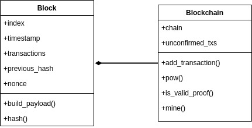

In the previous post we discussed some concepts in regard to blockchain. If you missed [this post](https://yuridelgado.dev/blog/introduction-to-blockchain/), I strongly suggest you to go back and take a read before moving forward.

I opt to use Python as the language for this post due to its simplicity, but the same code can be written in C++, Java or any other language you prefer.

## Defining entities

Before creating files and writing code, let’s think about the problem’s complexity for a moment.

### Block entity

The blockchain will be a list of blocks. Therefore, the first class will represent the block entity. Recalling the last post, a block has some attributes which will be used in the hash representation of the block. In this example, the attributes will be:

- Index: the position of the block in the chain. 0 is the genesis block.
- Timestamp: Unix timestamp.
- Transactions: list of transactions contained in the current block.
- Previous hash: the previous block’s hash.
- Nonce: the unique value used to mine a block in PoW.

To apply the hash function it is necessary to somehow serialize the attributes, convert them into a string or something like that. After we get a hashable input (a stringified JSON, for example), we will hash it and return the value.

### Blockchain entity

The blockchain will be responsible for gathering all the blocks, store the unconfirmed transactions (the ones that need validation from the network), apply some PoW algorithm (to mine blocks), check if a given proof is valid (peers will claim the proof, so it’s necessary to make sure they have the right one) and mine a block indeed (add it to the blockchain).

Keep in mind that the code we are writing today would be run by N peers all over the network because we are considering it public. Thus, a peer has to be able to perform all the actions I listed.

 

Figure 1. Diagram of block and blockchain classes.

 

Figure 1 shows a general view of both classes. I didn’t specify any type or arguments just because it’s a sketch and I wanted to save some time and space. :)

## Setting up the the project

In this project we are going to use five Python libraries: `json`, `hashlib`, `time`, `unittest` and `copy`. None of them require installation, they are natively available in Python 3.7 (the version I’m using in this post).

I like to use [Pipenv](https://pipenv.pypa.io/en/latest/) in my Python projects because managing requirements in Python can be a real pain.

So, create a folder calling it whatever you want and start your pipenv environment.

## Tests, tests, tests

It’s not because we are developing decentralized stuff that we will abandon tests. On the contrary, since it must be a fail-safe software that will run decentralized, we have to ensure that all our functions are behaving as we expect. Also, tests will help us to understand each piece of our software.

All our functions will have at least one test to give us some safety. I will not pursue a 100% test coverage in this post, but I recommend you to do it whenever you can.

Blockchain is not a trivial idea and involves a myriad of functions, so putting everything together and trying it all manually may not be the best or smartest way to make sure you got it and it’s working properly.

## The block class

Ok, before starting the tests, let’s define the block’s blueprint in `block.py` file:

<code-highlight language="python">
class Block:
   def __init__(self, index='', timestamp='', transactions=[], previous_hash='', nonce=0):
       self.index = index
       self.timestamp = timestamp
       self.transactions = transactions
       self.previous_hash = previous_hash
       self.nonce = nonce
 
   def build_payload(self):
       pass
 
   def hash(self):
       pass
</code-highlight>

It’s not a big deal, right? Pretty much the attributes and methods we discussed before.

Now, create a file called `test_block.py` with the following content:

<code-highlight language="python">
from block import Block
import unittest
from json import dumps
    
index = 1
transactions = ['a', 'b']
timestamp = 'ts'
previous_hash = 'b'
nonce = 100
new_block = Block(index, timestamp, transactions, previous_hash, nonce)
 
 
class TestBlock(unittest.TestCase):
    def test_build_payload(self):
        payload = new_block.build_payload()
        expected = dumps(dict(index=index, nonce=nonce, previous_hash=previous_hash,
                         timestamp=timestamp, transactions=transactions), sort_keys=True)
        self.assertEqual(payload, expected, 'Should match dicts')
 
    def test_hash(self):
        generated_hash = new_block.hash()
        self.assertEqual(len(generated_hash), 64, 'Should match hash')
 
if __name__ == '__main__':
    unittest.main()
</code-highlight>

First, I imported our Block class, the `unittest` library and the `dumps` function from the  [`json`](https://docs.python.org/3/library/json.html) library. The idea is to encode our attributes in order to get a hashable string. That’s what `dumps` does.
Right after the imports I defined a block sample just to make testing easier.

The first test checks if the encoding was done correctly based on the block’s attributes.

The second test, `test_hash`, just checks if the generated hash has 64 characters length (the size of a SHA-256 hash).

The [last part](https://www.freecodecamp.org/news/if-name-main-python-example/) is to ensure the execution scope.

Following the TDD methodology, let’s run the tests with `python test_block.py` (make sure you are running this inside your environment with `pipenv shell`).

You may have received a failing message. That’s fine, we don’t have our code yet.

Add the following line in the top of the `block.py` file:

<code-highlight language="python">
from json import dumps
</code-highlight>

The `build_payload` method becomes the following:

<code-highlight language="python">
def build_payload(self):
    return dumps(self.__dict__, sort_keys=True)
</code-highlight>

And the `hash` method:

<code-highlight language="python">
def hash(self):
    payload = self.build_payload()
    return sha256(payload.encode()).hexdigest()
</code-highlight>

It will apply the SHA-256 algorithm in the encoded payload and convert it to hexadecimal (standard notation).

Great, now, re-run the test for `test_block.py`. Both tests should be executed successfully.

## The blockchain class
Similarly to the block class, let’s define the blockchain class blueprint:

<code-highlight language="python">
class Blockchain:
   def __init__(self):
       self._chain = [Block(index=0, timestamp=time.time(), transactions=[],
                            previous_hash=0)]
       self.unconfirmed_txs = []
 
   def pow(self, block, difficulty=3):
       pass
 
   def is_valid_proof(self, block, proof_hash, difficulty=3):
       pass
 
   def add_transaction(self, transaction):
       pass
 
   def mine(self):
       pass
</code-highlight>

You can notice that I put some arguments in the method signatures. 

The `pow` method will be responsible for making the “heavy calculation” in order to mine a block. Remember: in PoW-based networks, miners have to demonstrate their computational power to process transactions and add blocks to the chain. This method will be the core of it. It receives a certain block (instance of our other class) and the difficulty. Bitcoin, for example, adjusts the difficulty of mining according to the network state. It can be more or less difficult. The parameter with default value 3 represents the amount of zeros that should be in our proof hash.

The `is_valid_proof` method will be used to check if a given hash attends to the PoW algorithm. Remember: a PoW algorithm has to be difficult to calculate but easy to verify. Otherwise, peers would have to use a lot of computational power just to verify the validity of a block. It receives the block in which the PoW algorithm was applied; the generated hash, also from the PoW execution; and the difficulty to match the number of zeros.

`add_transaction` will just append an unconfirmed transaction to the `unconfirmed_txs` array.

Last but not least, there’s the `mine`, the method that will gather everything.

### PoW method
Finally we reached the most interesting part, at least in my opinion. 
The `nonce` value is zero by default. Our goal here is to find a `nonce` such that when the block is hashed, the hash will have #`difficulty` leading zeros. Let’s take a look at a real world example.

That’s the hash of the block [692076](https://blockstream.info/block/00000000000000000012fbdbb03b7adbe08b7450a7b9286d075af8ee98c8142c?expand) of Bitcoin’s blockchain:
`00000000000000000012fbdbb03b7adbe08b7450a7b9286d075af8ee98c8142c`  

There’re 18 leading zeros. It means that the miner had to find a nonce that met the network difficulty at that time: 18. In this particular case, the nonce was 0x134088cc. Nowadays, if you don’t have special devices prepared for mining, it will not be possible to reach the nonce “answer” in a good time.

I think you got the idea. Time to write it:

<code-highlight language="python">
def pow(self, block, difficulty=3):
    proof_hash = block.hash()
    while not self.is_valid_proof(block, proof_hash, difficulty=difficulty):
        block.nonce += 1
        proof_hash = block.hash()
    return proof_hash
</code-highlight>
 
First, just get the current hash of the given block. While this hash doesn’t meet the difficulty condition, we increment the nonce and try again. That’s simple. We start in 0 and move forward one by one until the condition is met. The method is using another one that we didn’t talk about yet, let’s see it.

### Is the proof valid?
A proof-of-work has to be easily verified. Since we have a discovered `nonce` value, just apply the `hash` method in the block to check if it’s correct:

<code-highlight language="python">
def is_valid_proof(self, block, proof_hash, difficulty=3):
    computed_hash = block.hash()
    return computed_hash.startswith('0' * difficulty) and computed_hash == proof_hash
</code-highlight>

It’s pretty straightforward, isn’t it?

### Mining blocks
We are almost there.
Now, it’s time to mine the blocks. The steps are the following: 
Check if there’s at least one unconfirmed transaction in the network. There’s no point in mining nothing, we need transactions to mine.
Assemble the block that will be added to the chain with all the attributes needed.
Prove you have worked hard and get the proof hash.
Add the block to the chain.
Clear the list of unconfirmed transactions.

Read the steps again and take some minutes if you judge necessary.

The `mine` method will return the new block index, an integer.

<code-highlight language="python">
@property
def last_block(self):
    return self._chain[-1]
 
def mine(self):
    if not self.unconfirmed_txs:
        return -1
 
    new_block = Block(index=self.last_block.index+1,
                        timestamp=time.time(),
                        transactions=self.unconfirmed_txs,
                        previous_hash=self.last_block.hash())
 
    proof_hash = self.pow(new_block)
    self.verify_and_add_block(new_block, proof_hash)
    self.unconfirmed_txs = []
    return new_block.index
</code-highlight>

In order to get the last chain’s block right away, I created a method that uses the [`@property` decorator](https://docs.python.org/3/library/functions.html#property).

I opted to put the `verify_and_add_block` logic into another function to make it easier to test.

<code-highlight language="python">
def verify_and_add_block(self, block, proof_hash):
    previous_hash = self.last_block.hash()
 
    if previous_hash != block.previous_hash or not self.is_valid_proof(block, proof_hash):
        return False
 
    self._chain.append(block)
    return True
</code-highlight>

We can only add a valid block to the blockchain, therefore the reference to the previous block’s hash has to be correct and the proof-of-work has to be valid as well. If those conditions are met, the block is good to go.

### Adding transactions
Peers can add transactions to the blockchain, those transactions will be stored in a list until miners finish their job and confirm the transactions in a new block. Nothing new to add a transaction to the blockchain:

<code-highlight language="python">
def add_transaction(self, transaction):
    self.unconfirmed_txs.append(transaction)
</code-highlight>

### Utilities
I added two more methods (besides `last_block`) to the code. Both, `build_transaction`
and `print` (in block and blockchain classes) were useful to me to test.

<code-highlight language="python">
def build_transaction(self, sender, receiver, amount):
    return dict(sender=sender, receiver=receiver, amount=amount)
 
def print(self):
    for block in self._chain:
        block.print()
</code-highlight>

`build_transaction` simulates a scenario of a real transaction where you have a sender, a receiver and an amount that is being transferred. 

### Blockchain tests
Like the block class, blockchain class also deserves a test suite.
I will not explain what each test does, at this point you may be familiar with the logic of blockchain.

<code-highlight language="python">
from blockchain import Blockchain
from block import Block
import unittest
from json import dumps
from copy import deepcopy
 
index = 1
transactions = ['a', 'b']
timestamp = 'ts'
previous_hash = 0
nonce = 100
sample_block = Block(index, transactions, timestamp, previous_hash, nonce)
 
DIFFICULTY = 3
 
  
class TestBlockchain(unittest.TestCase):
 
    def test_last_block_with_only_genesis(self):
        blockchain = Blockchain()
        self.assertEqual(blockchain.last_block.index, 0,
                         'Should retrieve genesis block successfully')
 
    def test_last_block_with_one_more_block(self):
        blockchain = Blockchain()
        block = deepcopy(sample_block)
        block.previous_hash = blockchain.last_block.hash()
 
        blockchain.verify_and_add_block(
            block=block, proof_hash=blockchain.pow(block))
 
        self.assertEqual(blockchain.last_block.index, 1,
                         'Should retrieve last block successfully')
 
    def test_pow_success(self):
        blockchain = Blockchain()
        block = deepcopy(sample_block)
        proof_hash = blockchain.pow(block, difficulty=DIFFICULTY)

        self.assertEqual(blockchain.is_valid_proof(block, proof_hash, DIFFICULTY), True,
                         'Should apply PoW algorithm successfully')
 
    def test_pow_failure(self):
        blockchain = Blockchain()
        block = deepcopy(sample_block)
        proof_hash = blockchain.pow(block)
        block.nonce += 1
        self.assertEqual(blockchain.is_valid_proof(block, proof_hash, DIFFICULTY), False,
                         'Should apply PoW algorithm and fail due to wrong nonce counter')
 
    def test_is_valid_proof(self):
        blockchain = Blockchain()
        block = deepcopy(sample_block)
 
        proof_hash = blockchain.pow(block, difficulty=DIFFICULTY)
 
        valid = blockchain.is_valid_proof(
            block, proof_hash, difficulty=DIFFICULTY)
 
        self.assertEqual(valid, True,
                         'Should be valid')
 
    def test_add_transaction(self):
        blockchain = Blockchain()
        new_tx = blockchain.build_transaction(
            'SenderAddress', 'ReceiverAddress', 10)
 
        self.assertEqual(blockchain.unconfirmed_txs, [],
                         'Should return an empty unconfirmed transaction array')
 
        blockchain.add_transaction(new_tx)
 
        self.assertEqual(blockchain.unconfirmed_txs, [
                         new_tx], 'Should return 1 unconfirmed transaction in array')
 
    def test_verify_and_add_block(self):
        blockchain = Blockchain()
        block = deepcopy(sample_block)
        block.previous_hash = blockchain.last_block.hash()
 
        proof_hash = blockchain.pow(block)
 
        self.assertEqual(blockchain.last_block.index, 0,
                         'Should return only genesis block before adding second block')
 
        was_added = blockchain.verify_and_add_block(block, proof_hash)
 
        self.assertEqual(
            was_added, True, 'Should return true when add a valid block')
 
        self.assertEqual(blockchain.last_block.index, 1,
                         'Should return genesis block and the second block')
 
    def test_mine_with_unconfirmed_txs(self):
        blockchain = Blockchain()
        block = deepcopy(sample_block)
        block.previous_hash = blockchain.last_block.hash()
 
        unconf_tx = blockchain.build_transaction(
            'SenderAddress', 'ReceiverAddress', 10)
 
        blockchain.unconfirmed_txs.append(unconf_tx)
        next_idx = blockchain.mine()
        self.assertEqual(next_idx, 1, 'Should return the next index in chain')
 
    def test_mine_with_no_unconfirmed_txs(self):
        blockchain = Blockchain()
        block = deepcopy(sample_block)
        block.previous_hash = blockchain.last_block.hash()
 
        next_idx = blockchain.mine()
        self.assertEqual(
            next_idx, -1, "Should return -1 when there's no pending transaction")
 
if __name__ == '__main__': unittest.main()
 
</code-highlight>
 
The complete code of this post is available at [GitHub](https://github.com/yuricd/blockchain-concepts). 

### Increase the difficulty
We define the difficulty as 3 to run our code. Try to increment this value to 4 and 5, and re-run the tests. You will notice that the execution time will be significantly higher.

In my computer, I got the following running all the 9 tests:

 

|   Difficulty   |    Time (s)    |
|----------------|:--------------:|
| 1              |    0.153       |
| 2              |    0.174       |
| 3              |    0.218       |
| 4              |    1.278       |
| 5              |    49.302      |

Table 1. Difficulty vs. time (s) comparison.

 
 
Miners will spend more time solving the "challenge" as the difficulty increases. 

## Final words
Blockchain might not be trivial when we all are used to centralized apps that rarely require some consensus. Actually, blockchain might not be trivial if you are not a developer. The main idea is not that difficult to get, but the implementation details can be hard and some beginner’s questions can end up in a shallow (or not) explanation about cryptography, consensus, network, history, economy and basics of computer science.
 
I hope you have enjoyed and learned a little with the last two posts. Feel free to send me a message to talk about blockchain, cryptocurrencies or other stuff.
 
The complete code of this post is available at [GitHub](https://github.com/yuricd/blockchain-concepts). 
 
 
See ya!
