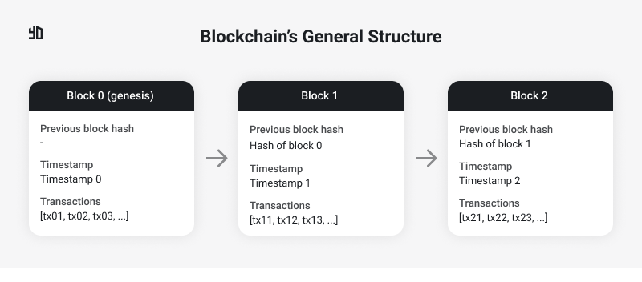
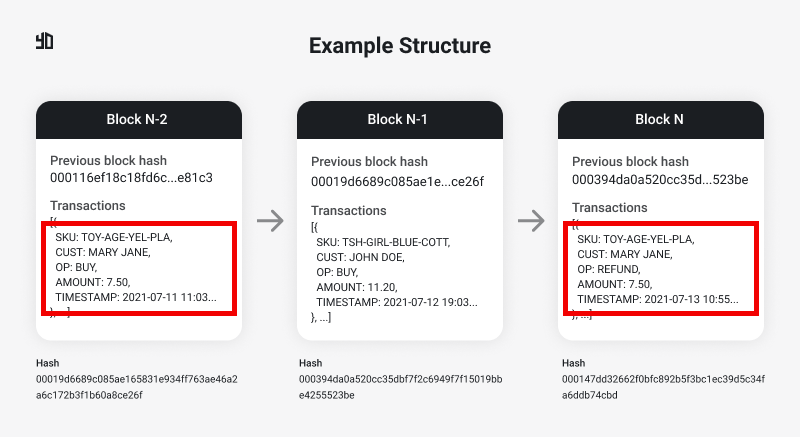
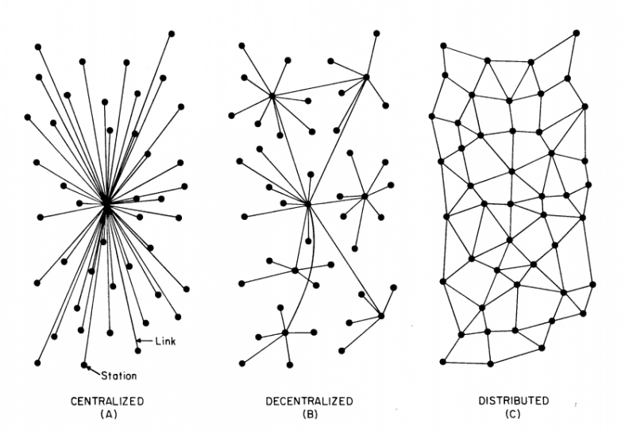

Today we’ll talk about one of my favorite technologies that I consider really disruptive: blockchain.
There’s a lot of confusion when it comes to blockchain. When someone hears that word, they might come up with misconceptions about what it is and what it intends to solve.

The first appearance of blockchain was in 2009, with the launch of Bitcoin. However, it’s not only related to cryptocurrencies anymore. Nowadays there are many public and private solutions like [Hyperledger](https://www.hyperledger.org/) projects, [Ethereum](https://ethereum.org/en/) (smart contracts), [EOS](https://eos.io/) (smart contracts), [Corda](https://www.corda.net/) and [Polkadot](https://polkadot.network/), to name a few.

Blockchain is not a programming language. You can’t program an app **in** blockchain, but you can use it as your storage or verification tool. You can assure the consistency of your transactions via blockchain.

Blockchain has not intrinsically more or less privacy, it depends on the way it is implemented. There are some solutions that bring privacy in transactions like Bitcoin, but they are trackable. [Monero](https://www.getmonero.org/), on the other hand, makes transactions untraceable. [Smart contracts](https://en.wikipedia.org/wiki/Smart_contract) may implement a [Trusted Execution Environment](https://en.wikipedia.org/wiki/Trusted_execution_environment) and many other ways to preserve the privacy of each part in a contract. But it’s not mandatory and, depending on the technology, they're not available out of the box.

## What is blockchain

Blockchain is a technology that aims to keep data immutable, therefore more reliable and a perfect fit for many use cases. You can compare it to a database. It will be the place to store data that implements [consensus algorithms](<https://en.wikipedia.org/wiki/Consensus_(computer_science)>) about when, how and by who things can be stored.

Think of a ledger, a big paper book that you will record transactions. In each page of this book you can record the transactions that happened within the day (you can use antoher rule, it's just an example). Let's say you work in a toy shop. Your ledger will store the customer's name, date, time, which product was bought and how much the customer paid for it. At the end of the day you may have some transactions in the page. That’s the most traditional way to manage cash flow.

Let’s pretend that two days after buying a broken toy, a customer comes to you and complains about it. She wants to give back the product and be refunded. What would you do, change the original page of the transaction that happened two days ago or write it in a new page? To make things easier, you could choose the former, but it could end up in many accounting problems for the store, stock prediction, divergence of information between sources and unreliability. Since the ledger can have its history changed anytime, what I am seeing today might be untrue tomorrow.

A blockchain would handle this situation by creating a new transaction without editing the old one. In this way, you can assure the reliability of the information anytime and you could keep track of the product, for example, to understand what happened in that case more precisely. Of course you could do it using a relational or non-relational database, even write it in a paper book using the principle of immutability and some [event sourcing](https://martinfowler.com/eaaDev/EventSourcing.html) approach. However, for many applications it is better to have this “feature” by design.

In comparison, you can think of using MongoDB to deal with many relationships between your entities or the opposite, using MySQL to deal with a total schemaless problem. Indeed you can, it will work somehow, but it’s far from the best solution.

Let’s take a look to a general structure of a blockchain:

 Figure 1. Blockchain's general structure.

A blockchain is a chain of blocks connected in a sequence. Each block can hold one or more transactions depending on the implementation. When the limit of transactions is reached, a new block is created, in other words, mined.

Using the previous store example, the blockchain would be something like:

 Figure 2. Blockchain of the Toy Shop Example.

Considering we create a new block per day, two days after buying the product “TOY-AGE-YEL-PLA”, Mary Jane decided to be refunded. It didn’t change the original block but recorded the refund event as a new transaction. As I mentioned, it’s very similar to an event sourcing architecture.

OK, blocks are appended to the chain, but what guarantees their immutability?

## What makes a block immutable

Below each bloch in Figure 2, there's a hash. The hash of a block is directly related to its content. Think of all the block's content, including its transactions, timestamp and other data concatenated, and apply a [hash function](https://en.wikipedia.org/wiki/Hash_function) on it. If you change a single bit in the content, the new hash will be totally different. A widely known example of hash functions are the [SHA](https://en.wikipedia.org/wiki/SHA-2) family standards, like SHA-256.

Consider the chain in Figure 2 again. If you decide to mutate the block N-2, its hash must change and the block N-1 will have a wrong reference in “Previous block hash”. So let’s update the block N-1 setting the previous block hash to the new computed hash of the block N-2. Great, block N-2 is mutated and block N-1 has the right reference to it. The problem is that block N is now wrong. Did you see the problem? You have to propagate any change in any block to the whole ledger.

In Figure 1, there's a block 0, also called genesis block. It's the very first block of a chain. Since it's the first block, there's no previous block to refer to.

Right, it’s an expensive mutation but it still can be done. What guarantee do we have that nobody is mutating some cryptocurrency blockchain and propagating the changes along the chain?

There are two concepts very closely-related to blockchain, they are decentralization and distribution. If you have one “copy” of the blockchain running in your machine, you have the power to do whatever you want. But when you have the blockchain running across a network of many peers, all of them following the same consensus (defined in the software layer), an odd one out, a rebel peer, could try to attempt against the blockchain integrity. They could mutate thousands of blocks, but at the moment those changes were sent to the network, none of those transactions would be considered valid, because they go against the consensus written in the application code.

## Centralized vs. Decentralized vs. Distributed

Figure 3. Kinds of network centralization.

Many people say that there’s no point in implementing a blockchain-based solution if it’s not going to run in a decentralized network. The nature of this statement is because, as we saw in the previous section, a small change in any block requires the acceptanc e of other peers.

When you have centralization, a single authority will decide what is valid and what is not. The consensus can be defined previously, but nothing assures it won’t be changed according to the authority interests or external influences. Examples: news website or a general ecommerce website.

A decentralized network does not require a formal acknowledgement or trust among the peers, they won’t have a central authority to approve transactions, dictate or change rules as it will. There’s a consensus that everyone agreed to follow and that’s it, no central authority or coordination is necessary. Cryptocurrencies, generally (not all), are decentralized. Bitcoin, Ethereum and BitTorrent are famous decentralized networks.

In a distributed network, you have the computation being made across different clusters or machines in different locations, but they are all coordinated and, at the end of the day, respond to the same authority. Telecommunication systems, cellular networks and [scientific projects](https://en.wikipedia.org/wiki/List_of_distributed_computing_projects) are good examples.

A blockchain that lacks decentralization would be just a fashionable way to implement a cool technology that does not leverage the points we discussed. I don’t totally agree with that statement due to my argument of “using the best technology for the problem”, as I said, as well a relational or non-relational database, blockchain can be the best solution for a certain problem either, regardless of the advantages a decentralized network can provide.

## Cryptography in blockchain

The design of blockchain assures the impossibility of changing a single block. It happens due to the hash value used as reference by each block.

Besides that, blockchain was a technology originally concepted to be used in a decentralized and public way. It means that every block is public to anyone. For example, you can check the information of any block of the Bitcoin’s blockchain here at [BlockStream](https://blockstream.info).

Anybody can see the amount transferred, the source and destination of that amount, when the transaction happened, etc. Imagine for a second your bank exposing publicly all the customer’s transactions and the personal information of each participant. Creepy, han? However, blockchain, specifically Bitcoin's algorithm, encrypts every information. From the wallet creation until the transaction confirming, your name is not displayed anywhere. Actually, you don’t need to provide any personal information when [creating a wallet](https://www.investopedia.com/best-bitcoin-wallets-5070283).

When you create a Bitcoin wallet, you receive a [private key](https://en.wikipedia.org/wiki/Public-key_cryptography), a big string that only you have access to and you can’t show it to anyone. Your private key is something like your bank account password. The difference is that the private key is unique and certainly bigger, and no one in the world, including the wallet developer, stores your key. Only you have access to it and total control of your balance. The transactions you do, the address of your wallet, all of it is done using your public key, another big string derived from your private key.

In Bitcoin’s blockchain, cryptography is strongly used in [proof-of-work (PoW)](https://en.wikipedia.org/wiki/Proof_of_work). In order to confirm transactions and mine blocks, miners have to complete challenges with different levels of difficulty according to the network status. There are many PoW algorithms out there. Bitcoin, for example, uses the [Hashcash](https://en.wikipedia.org/wiki/Hashcash) algorithm. The miner who solves the “puzzle” fastly is rewarded. PoW algorithm tends to be hard to compute but easy to verify because, after a miner submits its response to the network, other peers have to check quickly if that value is correct.

Talking briefly about PoW, the challenge is to find a hash for a new block that satisfies some condition. Since the content will generate a hash, we can put some constraint to generate it. Let's say we want to have three leadings zeros in the final hash. Well, if the block's content it's not changed, it wouldn't be possible, right? Because the same content will always generate the same hash. Yes, that's right. In this case we use a random and variable attribute called ["nonce"](https://en.wikipedia.org/wiki/Cryptographic_nonce). The idea is the following: I already have the block's content but I have to find some value that satisfies my condition (the three leading zeros) when concatenated with the rest of the block's content. Back to Figure 2, the hash of block N is `000147dd32662f0bfc892b5f3bc1ec39d5c34fa6ddb74cbd`. This hash has a nonce associated with the block. To simplify the example, I decided to not display the nounce value in the figure, but it could be something like `63135`. When you use the value `63135` concatenated with the rest of the block's content, the new hash will have the three leading zeros. You could set how many leading zeros would be necessary to mine a block. More zeros, more time to compute it. The goal is to find the nonce and each block will have its own.

PoW algorithms usually require more electrical energy due to the amount of computation required to mine a block. Miners with greater computational power tend to respond to the network quicker to be rewarded. Another approach to solve the mining issue is by [proof-of-stake (PoS)](https://en.wikipedia.org/wiki/Proof_of_stake). In this case, to have a block mined or a transaction validated you don’t need huge amounts of energy.

As I said, the cryptographic algorithms to validate blocks, generate each key, addresses, etc. are a matter of implementation, each software developer will use different hash algorithms and consensus with their own logic according to the network needs. IMO, that’s the most fantastic thing about it: we have thousands of different projects using different consensus algorithms, hash functions and different ways to deal with privacy and traceability. After some time, when the networks eventually get overloaded, it’s interesting to analyse how each one is performing, how long a transaction takes to be confirmed and completed and learn with each case.

Cryptography is a dense theme in CS and I’m not a specialist in this field. If you want to know more about it, there are tons of materials and courses on the web, it’s fascinating. The bottom line is that blockchain couldn’t even exist if cryptography was an unknown field.

## Final considerations

Blockchain is not a silver bullet, it does not solve all the problems in the best way. It’s a promising technology with a lot of room for improvement (as it’s been done since 2009) and many private applications such as logistics and supply chain, financial applications, health and medical data sharing, and smart contracts (here the list is almost endless).

Blockchain must not be a matter of teams side, like #teamBlockchain and #teamAgainstBlockchain. It’s a tool that can supply your project needs and specifications or not. The applications running with blockchain are strongly based on Math and Cryptography to run consensus algorithms and assure the consistency of the network. If you don’t like cryptocurrencies or think they’re all scams, it’s irrelevant from a blockchain technology perspective, because cryptocurrencies are just one of the applications of the blockchain.

The next post will be a simple implementation of a blockchain. Yes, we’ll write some code!

Cheers
