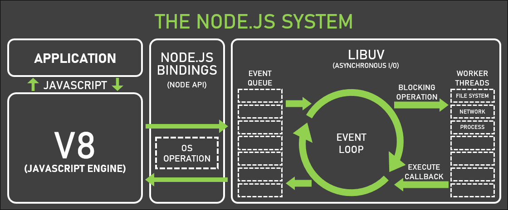

Probably your first experience with JavaScript was in the browser. Back in the day, you executed some DOM manipulation by using either vanilla JavaScript or jQuery. Among many different implementations in browsers, unexpected behaviors started being part of our development routine. Performance was also an issue due to the lack of standards.

Since the first implementation of JavaScript in 1995, many specifications were created, Chromium-based browsers became the de facto standard, and Node.js came up bringing JavaScript to places it had never been before. But how does it work?

## The beginning
Back in 2009, the most popular web server was Apache HTTP Server, which could handle multiple requests at the same time by using multiple threads. In the same year, Node.js was presented by Ryan Dahl at the JSConf EU. It was a promising idea that was combining V8 and libuv, an API written in C. The point is that Node.js is not a language, but an asynchronous event-driven runtime environment that allows JavaScript to be run on the server side.

Unlike the more common concurrency model based on multiple OS threads that can lead to dead-locking and inefficiency, Node.js is almost free of I/O operations and scales well because it relies on a small number of threads to handle many clients, using an event loop for orchestration and a worker pool for expensive tasks, such as I/O and CPU-intensive tasks.

V8 and libuv are the main dependencies of Node.js, but there are a few more such as http-parser, OpenSSL, and zlib.

This is an overview of the Node.js architecture:




You can look into Node.js implementation on their [official repo](https://github.com/nodejs/node).
In this post, I’ll focus on V8 and libuv.


## V8 engine
Google Chrome used to have a better performance when compared to other browsers interpreting JavaScript thanks to V8. This engine compiles JavaScript at run time by implementing a specific type of compiler called [JIT (Just in Time)]([https://en.wikipedia.org/wiki/Just-in-time_compilation](https://en.wikipedia.org/wiki/Just-in-time_compilation)) compiler. JIT compilation happens during the execution of the code, and not before it, as commonly happens in C or C++. By using JIT compilation, it’s possible to optimize and de-optimize the compilation according to the targeted CPU and OS aiming for the better performance possible.

V8 is part of the Node.js system but it’s also in the Chromium implementation, residing in Google Chrome, Opera, Brave, [Electron]([https://www.electronjs.org/](https://www.electronjs.org/)), etc.

### Tokens, parsers, and AST
The first step of V8’s flow is to generate tokens and send them to the parser, which creates nodes based on the syntax rules. Some examples of nodes are function and variable declarations, return statements, etc. Those nodes now can be assembled into a tree structure called AST ([abstract syntax tree]([https://en.wikipedia.org/wiki/Abstract_syntax_tree](https://en.wikipedia.org/wiki/Abstract_syntax_tree))).

### Ignition interpreter and the bytecodes
With the AST ready, it’s time to send it down to the Ignition interpreter that generates the bytecode of your script.

Let’s see what the byte code looks like. Consider the following piece of code:

<code-highlight language="javascript">
// sumObjValues.js
const sumObjValues = (obj) => obj.a + obj.b
sumObjValues({ a: 2,  b: 3 })
</code-highlight>

Now let’s run
<code-highlight language="bash">
node --print-bytecode --print-bytecode-filter=sumObjValues sumObjValues.js
</code-highlight>

The output is the following:

<code-highlight language="bash">
[generated bytecode for function: sumObjValues (0x019ff295b719 &lt;SharedFunctionInfo sumObjValues>)]
Bytecode length: 13
Parameter count 2
Register count 1
Frame size 8
OSR nesting level: 0
Bytecode Age: 0
   34 S> 0x19ff295c34e @    0 : 2d 03 00 01       LdaNamedProperty a0, [0], [1]
         0x19ff295c352 @    4 : c3                Star0 
   42 E> 0x19ff295c353 @    5 : 2d 03 01 03       LdaNamedProperty a0, [1], [3]
   36 E> 0x19ff295c357 @    9 : 38 fa 00          Add r0, [0]
   43 S> 0x19ff295c35a @   12 : a8                Return 
Constant pool (size = 2)
0x19ff295c2f9: [FixedArray] in OldSpace
 - map: 0x2b8e6b0c12c1 &lt;Map>
 - length: 2
           0: 0x2b8e6b0c8f71 &lt;String[1]: #a>
           1: 0x2b8e6b0c9031 &lt;String[1]: #b>
Handler Table (size = 0)
Source Position Table (size = 10)
0x019ff295c361 &lt;ByteArray[10]>
</code-highlight>


It might be scary but stick to the line starting with `34`. If you have ever seen some assembly code, it may look familiar to you. Ignition gives instructions to be run on a set of arguments. Those arguments are accumulators, registers (storage locations), or indexes in the memory.  Let's check it out line by line.

<br>

> LdaNamedProperty a0, [0], [1]

Loads the `[0]` value (second argument) into the accumulator (`a0`). Some lines below there's a lookup table with the following:

<code-highlight language="bash">
0: 0x2b8e6b0c8f71 &lt;String[1]: #a>
</code-highlight>

The value on index 0 maps to `a`, which is 2 in our case. So the value of the accumulator is 2. 

<br>

> Star0

Loads the accumulator value into the register `r0`, i.e., 2 goes to `r0`.

<br>

> LdaNamedProperty a0, [1], [3]

Similarly, this time loads the value of index 1 (also mapped in the table) to the accumulator, which is 3.

<br>

> Add r0, [0]

Adds the stored value in `r0` (2) to the current value in the accumulator (3), which is 5.

That’s the bytecode of `sumObjValues` generated by V8.

### Turbofan optimizer
There are some optimizations in the bytecode before running it. I didn’t mention what the last arguments of `LdaNamedProperty` and `Add` were. They are hidden classes, or shapes, basically a structure of the object that contains pointers to the offset containing the values of the key we are accessing. In simple terms, the optimizer caches the previous lookup to increase its performance when executing similar actions. The numbers in brackets are indexes in a vector that can be used quickly next time it's needed.

This optimization is possible when the shape of your object is always the same. Say you call `sumObjValues` hundreds of times with an object containing only the keys `a` and `b`. This is the best scenario for optimization. However, if you call the function with different object shapes (which doesn't make much sense in this example), but for example with keys `x`, `y`, and `z`, the initial optimization has to be undone and the original bytecode (without optimization) has to be used instead. That's an expensive operation, so try to keep the shape of the objects whenever you can (TypeScript is a good ally on that!).

## libuv
JavaScript is a single-threaded language. But how can it handle concurrency with only one thread? 

The libuv itself is an open-source library used by many projects now that can handle process communication, file system events, and thread pooling to name a few. But the secret of Node.js is the combination of a call stack, a callback queue, and an event loop.

Stack is a LIFO (Last In First Out) data structure. It means that the last item pushed to the stack will be popped first. Thus, the call stack will push every call to it and pop when it’s time.

A queue is FIFO (First In First Out) data structure where the oldest pushed item is popped from the queue, and not the last as in a stack.

### Event loop
The event loop is a kind of monitor of the call stack and the callback queue. It’ll pop from the call stack until it’s empty, and then will push to the stack the oldest event popped from the callback queue.

Let’s consider the following piece of code:

<code-highlight language="javascript">
console.log('Howdy')
setTimeout(() => {
  console.log('Timing out...')
}, 1000)
console.log('Where are you?')
</code-highlight>

1. In the beginning, we have both the call stack and the callback queue empty.
```
CS: []
CQ: []
```
<br>

2. `console.log('Howdy')` is pushed to the CS:
```
CS: [console.log('Howdy')]
CQ: []
```
<br>

3. `console.log('Howdy')` is executed ("Howdy" is printed) and popped from CS:
```
CS: []
CQ: []
```
<br>

4. `setTimeout` is pushed to CS:
```
CS: [setTimeout]
CQ: []
```
<br>

5. `setTimeout` is executed and popped from CS (not its callback yet!), but the timer functionality is an external API. We depend on this timer countdown to execute the callback. So the timer is scheduled externally and it'll push to CQ when it's time.
```
CS: []
CQ: []
Timer scheduled
```
<br>

6. `console.log('Where are you?')` is pushed to CS:
```
CS: [console.log('Where are you?")]
CQ: []
Timer scheduled
```
<br>

7. `console.log('Where are you?')` is executed and popped from CS:
```
CS: []
CQ: []
Timer scheduled
```
<br>

8. Past 1000ms, the external API will push the `setTimeout` callback to CQ:
```
CS: []
CQ: [setTimeoutCallback]
```
<br>

9. Since CS is empty, the oldest entry from CQ is pushed to CS:
```
CS: [setTimeoutCallback]
CQ: []
```
<br>

10. The last element of CS is executed, which is `setTimeoutCallback`, and its execution will push another call to CS, the `console.log('Timing out...')` :
```
CS: [setTimeoutCallback, console.log(`Timing out...`)]
CQ: []
```
<br>

11. Then `console.log('Timing out...')` is executed and popped:
```
CS: [setTimeoutCallback]
CQ: []
```
<br>

12. Finally, `setTimeoutCallback` is also popped because there's nothing else to run:
```
CS: []
CQ: []
```
<br>

All the steps above are handled by the event loop.

The case I brought is very intuitive because there are two `console.log`s, and one callback that will only be called after 1s due to `setTimeout`.

Let’s see if a small change in the timeout would make any difference in the output:

<code-highlight language="javascript">
console.log('Howdy')
setTimeout(() => {
  console.log(`Timing out...`)
}, 0)
console.log('Where are you?')
</code-highlight>

The timer now is set for 0ms, and not 1000ms. Can we say that the order of logs will change due to this change? Well, 0ms means “execute it right away”, right? No, it doesn’t.

There’s a tricky thing about the event loop: there’s an order to execute callbacks. Some calls take precedence over others.

In the described steps, I used one call stack and one callback queue, but actually, there are many callback queues, one for each phase of the event loop  . Let’s see the phases according to [Node.js docs]([https://nodejs.org/en/docs/guides/event-loop-timers-and-nexttick/#phases-overview](https://nodejs.org/en/docs/guides/event-loop-timers-and-nexttick/#phases-overview)):

1. **timers**: this phase executes callbacks scheduled by `setTimeout()` and ``setInterval()``.
2. **pending callbacks**: executes I/O callbacks deferred to the next loop iteration.
3. **idle, prepare**: only used internally.
4. **poll**: retrieve new I/O events; execute I/O related callbacks (almost all with the exception of close callbacks, the ones scheduled by timers, and ``setImmediate()``); node will block here when appropriate.
5. **check**: ``setImmediate()`` callbacks are invoked here.
6. **close callbacks**: some close callbacks, e.g. ``socket.on('close', ...)``.

Each one of those phases has its callback queue.

There’s also another kind of queue, a special one, called micro-tasks queue. This queue is executed between any of the phases. Some micro-tasks are:

- `process.nextTick`
- `Promises`
- `Object.observe`

See this example:

<code-highlight language="javascript">
import fs from "fs";
 
setTimeout(() => {
  console.log(`4`);
}, 0);
 
fs.readFile("some_file", () => {
  setTimeout(() => {
    console.log("6");
  }, 0);
 
  setImmediate(() => {
    console.log("5");
  });
});
 
Promise.resolve()
  .then(() => console.log("2"))
  .then(() => console.log("3"));
 
console.log("1");
</code-highlight>

1. All the synchronous code is executed first, so the first thing to be output is `1`.
2. Considering the event loop phases, expired timers are the next thing to be executed. However, as I mentioned, `Promises` go to the micro-tasks queue and are executed between any phase. Thus, `2` and `3` are printed.
3. No more resolved `Promises` calls, then expired timers come and `4` is logged.
4. Within `readFile` callback, we have a `setTimeout` and `setImmediate` call. Following the phases, we could say that the `setTimeout` callback would be executed first. It could be true in this example:

<code-highlight language="javascript">
setTimeout(() => {
  console.log('timeout');
}, 0);
 
setImmediate(() => {
  console.log('immediate');
});
</code-highlight>

But even here, the order of the output depends on the performance of the process, it’s non-deterministic.

When it comes to this race within an I/O cycle, [`setImmediate` callback is always executed first]([https://nodejs.org/en/docs/guides/event-loop-timers-and-nexttick/#setimmediate-vs-settimeout](https://nodejs.org/en/docs/guides/event-loop-timers-and-nexttick/#setimmediate-vs-settimeout)). Thus, `5` and `6` are printed.

## Final words
V8 and libuv are not the simplest things on Earth, indeed, but they are very interesting and a game changer when it comes to both front and back-end development. 

Unfortunately, I couldn’t cover many features and details of Node.js in this post, but I highly recommend you to take a look at the [official docs]([https://nodejs.org/en/docs](https://nodejs.org/en/docs)) and the amazing series of posts from [Lucas Santos on dev.to]([https://dev.to/_staticvoid/node-js-under-the-hood-1-getting-to-know-our-tools-1465](https://dev.to/_staticvoid/node-js-under-the-hood-1-getting-to-know-our-tools-1465)).

Thank you for reading and I hope you could learn a little from this post.

See ya!