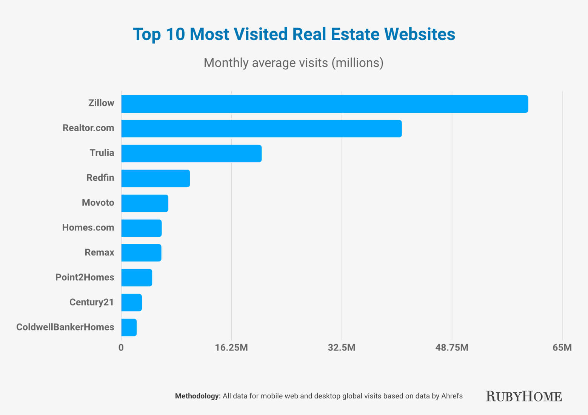
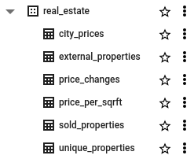

**TL;DR** 
I created a cool data visualization using real estate data from Orlando, FL, and Stamford, CT. You can check it out [here](https://yuridelgado.dev/de-zoomcamp/). To do that, I used Airflow, Google Cloud Storage, BigQuery, and Looker.

---

In the last quarter, I was challenged in [Loka](https://loka.com)’s Data-Engineering bootcamp hosted by [Henrique Silva](https://pt.linkedin.com/in/henrique-ribeiro-silva). I had never studied in minimal depth DE topics, but the challenge caught my eye and I ended up practicing a lot of tools and understanding better how to build ETLs.

The syllabus was the following:

- Containerization with [Docker](https://www.docker.com/)
- IaC with [Terraform](https://www.terraform.io/)
- Workflow orchestration with [Apache Airflow](https://airflow.apache.org/)
- Data ingestion and warehouse with [GCP](https://cloud.google.com/): Transfer Service, BigQuery, and Storage
- Partitioning and clustering
- Data transformation with [dbt](https://www.getdbt.com/)
- Batch processing with [PySpark](https://spark.apache.org/docs/latest/api/python/)
- Stream processing with [Apache Kafka](https://kafka.apache.org/)
- Data analysis with [Looker/Google Data Studio](https://lookerstudio.google.com/)

A lot of things to study, to apply in homework, and to discuss with my peers.
After finishing the topics, a project should be done using the tools we learned. No specific subject. My colleagues presented awesome projects in different fields: gaming, flights, analysis of how tweets influence the stock market, etc. After a few days, I came to the conclusion that my project would be about the real estate market. Why? Because I spent a few years in this sector, I like it, and it’s a traditional market, not prone to innovations.

## What to solve
The subject was set, now what to solve exactly? Leases, sales, asset management, and investment intelligence, every place has room for technology.
During my time in the real estate market, one of the most exciting things I worked with was market intelligence. Data is very powerful, and bringing data insights to base decisions is awesome, especially when you are in a market with fluctuation and frequent crises.
Say you have hundreds of thousands of dollars to invest in real estate. You’ve saved that money for years, and now you want to make good use of it. Then, buying a property in the right place can generate a good passive income for you.

## Development process
Fortunately, there are several websites that aggregate properties in the US, Europe, Brazil, etc. Considering the size of the markets and data availability, I opted to go with US data.

 Figure 1. Top 10 most visited real estate websites in US.

Zillow seemed to be a good source of data. Since my goal was not to get data from a hundred different cities across the whole country, a simple scraper could handle that.
I wanted to compare cities in different situations in terms of tourism, property availability, income, etc. So the cities that came to my mind were Orlando, FL, and Stamford, CT (I don’t know why, it just popped into my mind, and it was a good candidate, indeed).

### 1. Getting the data
To scrape Zillow I only had to understand how the requests were made to the server and remake them with my parameters. Settings the city name, some bounds, and a few other parameters were enough. 

With the script ready, I put that in two Airflow’s DAGs, one for Orlando and another one for Stamford. Both were supposed to run once a day, from 01/13/2023 to 01/18/2023.

### 2. Saving in the data lake
The endpoint response is in JSON format, then I converted it to CSV and sent it to Google Could Storage, in a previously created bucket. Each file was identified with the current date.

### 3. Reading with BigQuery
The hardest part was turning the raw data into meaningful information. I had to come up with different ideas of useful data for comparison.

Since I scraped the same cities for one week, it was natural to have duplicated data. So, an important number to know was how many **unique properties** I got in that period.

Knowing the **number of bedrooms** and the **property distribution** along the city is crucial.

When it comes to prices, the **average per square foot** and its **distribution** in the city are also important to take into account the budget vs expected [ROI](https://www.investopedia.com/terms/r/returnoninvestment.asp).

After a while, I had the idea to **track price changes**, i.e., during that week, how many properties changed their prices and how much that changed.

The last, and most challenging, information I wanted to have was about sold properties in the period. It’s not too straightforward to get this information because it’s not explicit. I had to rely on some heuristic for that. My approach was to track which property had been advertised on any day in that week and then stopped being advertised in the following days. Of course, the owner could only have stopped the ad for a few days. It was a relatively simple heuristic to apply though.

Since my data was not changing in real time and I already had all the data needed, I created external tables for pretty much all of the aforementioned analyses:

 Figure 2. BigQuery external tables.

### 4. Creating the report with Looker Studio
Now, time to get all the data I have and turn them into meaning information, with charts, tables, map views, etc. You can check out the result [here](https://yuridelgado.dev/de-zoomcamp/).

P.S.: unfortunately the unique properties number became zero after the trial period of GCP. 🤷🏻‍♂️

The numbers are:
 
Scraped properties in Stamford: 1,185
 
Scraped properties in Orlando: 6,400 

## What to do next
This was a project for studying purposes, but let’s say I’d maintain this project running. Here is a list of improvements I’d do:

1. Run for a few months to understand the average time to sell a property
2. Aggregate data from other cities and countries
3. Rotate IP addresses to avoid ban
4. Improve the “sold” heuristic
5. Create ML models to predict the time to sell, best features, etc.
6. Add more DA insights

Thank you for reading and hope you have enjoyed it. If you want to take a look at the code, here is the [repo](https://github.com/yuricd/de-real-estate-project).

See ya!